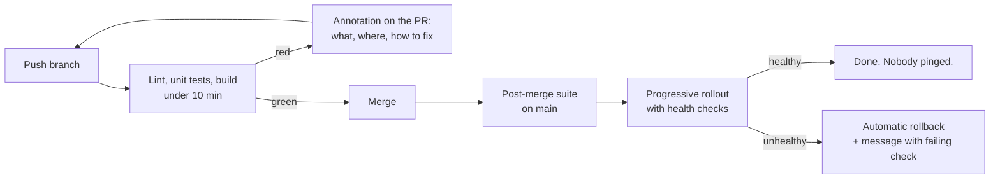

Ask a developer which tool they touch most after their editor, and the honest answer is usually the CI pipeline. Every branch, every pull request, every deploy goes through it. Yet it is almost always designed by people who rarely have to wait on it.

<!-- more -->

That gap shows. Pipelines get optimised for what is easy to run, easy to secure, and easy for the platform team to maintain. Developer time spent waiting is invisible on every dashboard, so it never gets fixed.

I have been on the platform side of this for most of my career, and I noticed the gap the way most platform engineers do: through the support channel. The same three questions kept coming back. *Why is it slow? Why is it red? Can someone re-run it?* None of them were about the product. All of them were about the pipeline.

## What developers actually want from CI

Strip away the tooling and developers want four things from a pipeline:

| They want | Which means |
|---|---|
| **Fast feedback** | Know within minutes whether the change is fine |
| **Clear failure** | When it is red, know why without opening five logs |
| **Trust** | Red means broken. Green means safe to merge. No exceptions |
| **No ceremony** | Merging and deploying should not need a meeting, a ticket, or a favour |

Everything below is about delivering those four things. Every pipeline feature that does not serve one of them is a cost, not a benefit.

## 1. Feedback in under ten minutes, or split the pipeline

A pull request check that takes thirty minutes trains developers to context-switch. They open another task, forget the PR, and come back an hour later. The real cost of a slow pipeline is not the thirty minutes. It is the hour of lost focus on both sides of the review.

The fix is rarely a faster machine. It is deciding what must run *before* merge and what can run *after*. Lint, unit tests, and a build belong in the PR check. Full integration suites, long security scans, and multi-platform builds can run on the main branch after merge, with a fast path to revert.

!!! example "What this looked like for me"

    The slowest pipeline I inherited ran the full integration suite against a real database on every pull request. It took over half an hour on a good day, and a good day meant nobody else was pushing.

    We moved integration tests to run on `main` after merge, and kept lint, unit tests and the build in the PR check. The PR check dropped to under ten minutes. The integration suite still ran on every merge, just not in the developer's way.

    One thing did slip through: a database migration that passed unit tests broke the integration run on `main`. It was caught within minutes and reverted with one click. That was the whole point of the split. A failure on `main` costs one revert. A slow PR check costs every developer, every day.

## 2. A failure should tell you what broke in the first screen

The most expensive kind of pipeline failure is the one where the developer has to scroll through two thousand lines of log to find a single `AssertionError`. Every minute spent hunting for the failure is a minute the pipeline has actively wasted.

What helps, in order of impact:

- **Fail the job with a one-line summary** at the top of the output, not buried at the bottom.
- **Annotate the PR** with the failing test, file, and line. Most CI systems support this. Most pipelines never bother.
- **Name jobs after what they check**, not after the tool. `unit-tests` beats `pytest-run-3`.
- **Link to the fix** when the failure is a known category. A lint failure should point to the command that fixes it locally.

!!! example "The error message that generated the most support requests"

    For a long stretch, the single most common message in our platform channel was some version of *"my tests are failing with exit code 137 and I did not change anything."*

    Exit code 137 means the process was killed, almost always because the runner ran out of memory. The tests were fine. The test *runner* was being killed mid-suite because the job was sharing a small machine with a build step that ate all the RAM.

    The real fix was giving test jobs their own memory limit. But the cheaper fix, which we shipped the same day, was a wrapper step that caught exit code 137 and printed one line: *"Job was killed for exceeding memory. This is a runner problem, not your code. See link."* Support requests for that error stopped almost entirely. The developers had never needed the fix. They had needed the explanation.

## 3. Flaky tests are a platform problem, not a developer problem

Nothing destroys trust in a pipeline faster than a test that fails one run in ten for no reason. Developers learn to click *re-run* on red without reading. Once that habit sets in, real failures get re-run too, and the pipeline stops meaning anything.

The uncomfortable part is that the platform team usually knows which tests are flaky and leaves them in, because removing a test feels like lowering the bar. It is the opposite. A test nobody believes is not raising the bar. It is noise with a green tick.

What I think works:

- **Track the re-run rate per job.** It is the most honest developer-experience metric a pipeline has.
- **Give every flaky test an owner and a deadline.** Fix it or move it out of the merge path until it is fixed.
- **Never retry silently.** Automatic retries hide the problem and make the pipeline slower for everyone.

!!! example "How flakiness actually showed up"

    We did not find our flaky tests by looking at test reports. We found them by counting re-runs. Roughly one in five pull requests was being re-run at least once before it went green, and when we looked at *why*, the same handful of tests appeared every time.

    Most of them had the same root cause: they assumed something about the machine they ran on. A fixed port that was sometimes taken. A timing assertion that held on a laptop and failed on a busy shared runner. A test that depended on the order another test left the database in.

    The ones we could fix, we fixed. The ones we could not fix quickly moved to a separate nightly job with a named owner and a date. They still ran. They just stopped blocking merges. The re-run rate fell to a level where a red PR check became worth reading again.

## 4. The difference between running code locally and in CI should be almost zero

Every gap between a developer's machine and the pipeline is a place where *"it works locally"* becomes a true statement and a useless one. The developer did nothing wrong. The pipeline did nothing wrong. They were simply running two different things.

Those gaps are rarely dramatic. A different Python version. A dependency resolved differently. An environment variable that exists on the laptop and not on the runner. A file that is present locally and ignored by git. Each one costs a developer an hour of confusion and a support message to the platform team.

The target should be that a developer can run one command locally and get the same result the pipeline will give. Not similar. **The same.**

!!! example "The one that took an afternoon to find"

    A developer pushed a change that used newer language syntax. It ran fine on their laptop. The pipeline went red with a syntax error on a line that was obviously valid. They re-ran it. Red again. They pushed a no-op commit. Red again. Then they asked in the channel.

    It took most of an afternoon to find the cause: the CI image was pinned to a runtime two minor versions older than the one on the laptop. Nobody had changed anything. The runtime version was defined in the pipeline config and nowhere in the repository, so local and CI had simply drifted apart over time without anyone noticing.

    The fix was three lines. The runtime version went into a version file in the repo that both the developer tooling and the pipeline read. The dependency lockfile was committed and installed with an exact-match flag on both sides. The CI job was changed to run inside the same container image developers could run locally.

    The lesson generalises: **anything that defines the environment belongs in the repository, versioned, and read by both sides.** Anything that lives only on a laptop or only in a CI setting is a bug waiting for its moment.

How to keep the gap closed:

- One entry point in the repo, a `Makefile`, `justfile`, or task runner, that defines `lint`, `test`, and `build`. The pipeline calls those targets and nothing else.
- Pin the runtime version in the repo, not in the pipeline config.
- Commit lockfiles and install from them with exact matching on both sides.
- Keep secrets and configuration out of the test path. If a test needs a token to pass, it is not a unit test.
- When the pipeline fails, the reproduction step is always the same: run the target locally. If that does not reproduce it, the gap *is* the bug, and it goes to the platform team, not the developer.

## 5. Shared templates, not copied YAML

In any organisation with more than a handful of repos, pipeline definitions get copied. Then one copy gets a fix and the others do not. Six months later there are eleven slightly different versions of the same deploy job and nobody knows which one is right.

The alternative is a small set of reusable pipeline templates owned by the platform team, versioned, with a changelog. Application repos call the template and pass a few parameters. When the template improves, every repo gets it on the next run.

The trade-off is real: templates centralise control, and a bad template change breaks everyone at once. That is a reason to test templates properly, not a reason to avoid them.

!!! example "The migration was easy. The customisations were not."

    When we consolidated, we had dozens of repos, and almost every one had started life as a copy of another repo's pipeline. Moving the ones that had never been touched was straightforward. Point them at the shared template, run it, done.

    The hard part was the repos with *small customisations*. An extra step here, a different flag there, added by someone who had since left, for a reason nobody remembered. Each one needed a conversation: is this still needed, and if so, should the template support it? Most of them were not needed. A few were, and they made the template better.

    What I would do differently is version the templates from day one and publish a changelog. The first time a template change broke a downstream repo, the question was not *what changed* but *when*, and we had no clean answer.

## 6. Deploying should be boring, and rolling back should be more boring

A deploy that needs a runbook is a deploy people avoid. A deploy that happens on merge, with automatic rollback if health checks fail, is one people do ten times a day without thinking.

The signs a deploy process is hurting developer experience:

- People batch changes to avoid deploying often.
- Deploys happen at fixed times, usually chosen for the platform team's comfort.
- Rollback is a different, harder process than deploy.
- Someone has to be pinged.

Every one of those is a design choice, and every one of them can be reversed.

!!! example "From a scheduled deploy window to deploy-on-merge"

    At its worst, production deploys happened in a window a few times a week, with a platform engineer watching. Developers batched changes to hit the window, which made every deploy bigger, which made every deploy riskier, which was the argument for keeping the window. The process was defending itself.

    At its best, a merge to `main` built the image, ran the post-merge suite, and rolled it out to Kubernetes progressively. Health checks and error rate decided whether the rollout continued. If they failed, the rollout reversed itself and posted a message with the failing check. Nobody watched. Nobody needed to.

    The single change that made rollback boring was making it *the same operation as deploy*. Rolling back meant deploying the previous image tag through the same pipeline. No special runbook, no separate permissions, no person on call to run it.

## 7. Remove the gates that do not add information

Manual approvals feel like safety. Most of them are theatre. If the approver clicks *approve* without reading, because they always click *approve*, the gate is adding delay and no protection.

A gate earns its place when the person approving knows something the pipeline cannot check. Most of the time, what they are checking can be automated: a security scan, a policy check, a required reviewer on the code itself. Automate it, put the result in the PR, and remove the manual step.

!!! example "The approval that approved everything"

    Every production deploy needed a sign-off from a change manager. When we looked at the history, the approval rate was effectively one hundred percent, and the median time between request and approval was measured in hours. Not because anyone was reviewing. Because the request had to wait for someone to notice it.

    We replaced it with the checks the approver was supposed to be doing: tests passed, security scan passed, code was reviewed by someone on the owning team. All three were already visible in the pull request. The manual gate stayed for exactly one category, database migrations, where a human genuinely did know something the pipeline could not.

    The argument for keeping the gate was audit. The answer was that a pipeline log with named checks and a timestamp is a better audit trail than a click.

## What this looks like from the developer's chair

Put together, a pipeline built for developer experience looks like this:

1. Push a branch. Within minutes, lint and unit results are annotated on the PR.
2. If something is red, the annotation says what and where, and the fix command is one copy-paste away.
3. Green means safe to merge. Nobody re-runs on principle.
4. Merge. The main branch builds, runs the slow suite, and deploys to production with health checks.
5. If health checks fail, it rolls back on its own and posts a message with the failing check.

None of this is exotic. Every piece exists in every major CI system today. The reason most pipelines do not look like this is that nobody made the developer's experience the goal.

## Takeaways

- **Measure the pipeline from the developer's side:** time to feedback, re-run rate, time from merge to production.
- **Anything slow goes after merge.** Anything flaky goes out of the merge path until it is fixed.
- **Local and CI must run the same thing.** Pin the runtime, commit the lockfile, share the container image, keep the YAML thin.
- **Deploys happen on merge.** Rollback is the same operation, run backwards.
- **Every manual gate has to justify itself** with information the pipeline cannot get on its own.

The part I am still working out is how to keep a pipeline this way once it exists. Every one of the problems above crept back in slowly, one reasonable-sounding exception at a time. Keeping the developer's experience as the design goal is not a project. It is maintenance.
