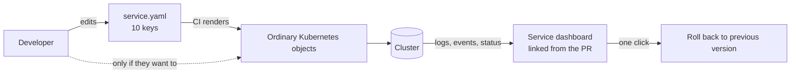

Nobody on an application team wakes up wanting to learn Kubernetes. They want to ship a service, see it running, and fix it when it breaks. Kubernetes was a decision the platform team made, usually for good reasons, and then handed to people who never asked for it.

<!-- more -->

I have been on the side that made that decision. I still think it was right. But I have also watched what it costs a developer the first time they see `CrashLoopBackOff` in a terminal and have no idea what it means, who to ask, or whether it is their fault. That moment is where a lot of developer experience quietly goes to die.

This post is about closing the gap between what developers need from a cluster and what the cluster asks of them in return.

## What developers asked for, and what they got

| They asked for | What the cluster asked of them |
|---|---|
| Deploy my service | Write a Deployment, a Service, an Ingress, maybe a ConfigMap and a Secret |
| See my logs | Learn `kubectl`, find the right namespace, find the right pod, pick the right container |
| Roll back | Know that rollouts have history, know the command, have permission to run it |
| Know if it is healthy | Understand readiness versus liveness probes and what happens when each fails |
| Give it enough memory | Understand requests versus limits, and what `OOMKilled` means at 2 AM |

None of the right-hand column is unreasonable for a platform engineer. All of it is unreasonable to expect of someone whose job is the left-hand column.

## 1. Start from the three things developers actually do

Strip away the tooling and a developer interacts with the runtime in three ways: deploy a version, look at what it is doing, and go back to the previous version when something is wrong. Everything else is either rare or someone else's job.

That means the first question about any Kubernetes platform is not "which ingress controller" or "which service mesh". It is: *how many steps does it take a developer to do each of those three things, and how many of those steps require knowing a Kubernetes concept?*

!!! example "What this looked like for me"

    When I first mapped the deploy path for a typical service, I counted the Kubernetes concepts a developer had to touch to get from a merged pull request to a running pod they could see. It was somewhere around ten: namespace, deployment, service, ingress, image pull secret, config map, resource requests, probes, labels that had to match exactly, and the `kubectl` context to even look at any of it.

    Most developers had learned exactly enough to copy the previous service's YAML and change the name. Which worked, until it did not, and then nobody could explain why.

## 2. Every concept you expose becomes a support ticket

Kubernetes leaks. Not in a technical sense, but in the sense that every abstraction it offers eventually shows up in a developer's terminal as an error they cannot decode.

Some of these leak more than others. In my experience the ones that generate the most confusion, in rough order:

1. **Resource limits and `OOMKilled`.** The pod dies, restarts, dies again. The application logs show nothing because the process was killed from outside.
2. **Probes.** A service that is fine but slow to start gets restarted forever because its liveness probe fires too early.
3. **Labels and selectors.** A Service pointing at nothing because one label has a typo. No error. Just no traffic.
4. **Namespaces and contexts.** "My pod is not there." It is there. They are looking in the wrong namespace.
5. **Image pull errors.** A tag that was never pushed, or a registry credential that expired.

!!! example "The one that came up every week"

    The single most repeated question I dealt with was some version of *"my pod keeps restarting and the logs are empty."* Nine times out of ten it was `OOMKilled`. The developer had copied a memory limit from another service, their service needed more, and the kernel killed it before it could log anything.

    The fix that finally reduced the questions was not documentation. It was making the deploy tooling print the pod's last termination reason next to the logs, in plain words: *"This container was killed for exceeding its memory limit of 256Mi. Raise `memory` in your service config or investigate memory usage."* The developer never needed to know what a limit was. They needed to know what to change.

## 3. Put a thin layer in front, not a whole new platform

The tempting answer to all of this is to build an internal platform that hides Kubernetes completely. I have seen that go wrong more often than it goes right. The layer becomes its own thing to learn, it lags behind the features teams need, and when it breaks the developer is now two abstractions away from the actual problem.

The approach I have had the most success with is thinner: a single, opinionated template that turns a small config file into all the Kubernetes objects a service needs.

```yaml
# service.yaml, the only file a developer edits
name: orders-api
image: registry.internal/orders-api
port: 8080
replicas: 2
memory: 512Mi
cpu: 250m
healthcheck: /healthz
env:
  LOG_LEVEL: info
```

Behind that file is a Helm chart, or a Kustomize base, or a small script. It does not matter which. What matters is that the developer never writes a Deployment by hand and never sees a label selector, but the objects that get created are ordinary Kubernetes objects that anyone on the platform team can inspect with standard tools.

!!! example "The template that replaced the copy-paste"

    We replaced per-service YAML with one shared chart and a values file of roughly ten keys. Migrating existing services was mostly deleting things. The chart set sensible defaults for everything the values file did not mention, so a brand new service needed four lines to deploy.

    The trade-off was real. A handful of services needed something the chart did not support, like an extra sidecar or a specific affinity rule. We added an escape hatch that let a service ship raw Kubernetes manifests alongside the values file. Almost nobody used it. The few who did were the people who actually understood Kubernetes, which is exactly who should be writing raw manifests.

## 4. Do not hide the things they will need at 2 AM

Hiding complexity during the happy path is good. Hiding it during an incident is dangerous. A developer being paged about their own service needs to get to logs, recent events, and a rollback in under a minute, without a platform engineer in the loop.

What that requires, concretely:

- **A direct link to logs** for the service, ideally posted on the pull request or in the deploy notification, not a `kubectl` incantation.
- **Events in plain language.** "Pod restarted 4 times in 10 minutes, last reason: OOMKilled" beats a raw `kubectl describe` dump.
- **Read access by default.** Developers should be able to look at anything about their own service without asking.
- **Rollback as a button or a single command.** Not a runbook.



!!! example "The incident that changed my mind about access"

    Early on, developers did not have `kubectl` access to production at all. Everything went through the platform team. The reasoning was safety. The effect was that every incident, however small, needed a platform engineer awake before anyone could even look at what was happening.

    After one late-night incident that was a five-minute fix once someone with access finally looked, we gave every team read-only access to their own namespace and a rollback command they could run themselves. The number of incidents did not go up. The time to resolve them went down noticeably, and the platform team stopped being the bottleneck for problems that were never theirs.

## 5. Defaults are decisions, so make them good ones

Every field a developer does not set is a decision the platform made for them. In Kubernetes, most of the defaults are wrong for a production service: no resource requests, no probes, one replica, no pod disruption budget.

A good template treats defaults as the main product. A service that specifies nothing should still get:

- Resource requests and limits that are conservative but not tiny.
- A readiness probe on the health endpoint, with a start-up grace period long enough for a slow JVM or a database migration.
- Two replicas, spread across nodes.
- Rolling updates that keep the old version serving until the new one is ready.

!!! example "The default that bit us"

    For a while our template set no resource requests unless the developer added them. Most did not, because they did not know they should. The result was a cluster where the scheduler had no idea how much anything needed, nodes got overcommitted, and the noisiest service on a node would starve its neighbours.

    Setting a modest default request for every service, and making the template refuse to render without one, fixed most of the scheduling problems in one change. Nobody on an application team noticed, which was the point.

## 6. Rollback must be as easy as deploy, and faster

If deploying is a merge and rolling back is a ticket, developers will not roll back. They will try to fix forward under pressure, which is how a small incident becomes a large one.

Rollback should be the same mechanism as deploy, pointed at the previous version. In Kubernetes that can be as simple as `kubectl rollout undo`, but the developer should not need to know that. They need a command or a button in the same place they deploy from, and it needs to complete in seconds, not minutes.

The test I use: can a developer who joined last week roll back their own service during an incident without asking anyone? If the answer is no, the platform is not done.

## Takeaways

- **Count the concepts.** For deploy, logs, and rollback, count how many Kubernetes ideas a developer must understand. Aim for zero on the happy path.
- **Translate the errors.** `OOMKilled`, failed probes, and empty selectors should surface as plain sentences that say what to change.
- **Thin template, ordinary objects.** A small config file in, standard Kubernetes manifests out, with an escape hatch for the few who need it.
- **Never hide the incident path.** Logs, events, and rollback must be one click away for the service owner, with no platform engineer required.
- **Good defaults are the product.** Requests, probes, replicas, and rolling updates should be right when the developer says nothing.

The part I still have not solved is what happens when the thin layer needs to change. Every template update is a change to every service at once, and I do not yet have a way to roll that out that feels as safe as rolling out a single service.
