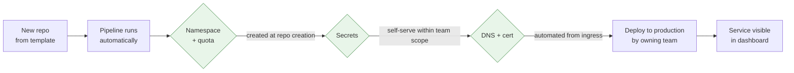

Every internal platform I have seen described in a slide deck was self-service. Developers would "spin up a new service in minutes" with "no tickets" and "no waiting on the platform team". I have never seen one of those slides that was accurate on the day it was presented.

<!-- more -->

That is not because the people writing the slides were lying. It is because self-service is a property of the whole path a developer walks, and the slide only describes the part the platform team built. The parts they did not build, the access request, the DNS entry, the secret that has to be created by someone else, the approval that lives in a different tool, are invisible from the platform side and completely visible from the developer's.

This post is about measuring that gap honestly, and about what actually closes it.

## The only definition that matters

Self-service means a developer with a normal amount of access can go from "I need a new service" to "it is running in production and I can see it" without asking a human for anything.

Not "without asking the platform team". Without asking *anyone*. The moment there is a ticket, a Slack message, or a form that someone else has to act on, the path is not self-service, no matter how good the tooling is on either side of that gap.

That definition is strict on purpose. A path that is self-service except for one step is not ninety percent self-service. It is blocked at that step, and every developer will wait there.

## What the path usually looks like

Here is the shape of the path I have seen most often, regardless of company or tooling. The platform team owns the middle. The friction lives at the edges.

| Step | Who does it | Self-service? |
|---|---|---|
| Create the repository from a template | Developer | Yes |
| Get the pipeline running | Developer, using the shared template | Yes |
| Get a namespace or environment | Platform team, via ticket | No |
| Get a database or queue | Another team, via a different ticket | No |
| Get secrets into the environment | Security or platform, via request | No |
| Get a DNS entry and certificate | Network team, via email | No |
| Get production deploy permission | Manager approval, via form | No |
| First production deploy | Developer | Yes |

The three "yes" rows are what the slide describes. The five "no" rows are what the developer remembers.

!!! example "What this looked like for me"

    The first time I actually walked the path myself, start to finish, as if I were a developer on a product team, it took the better part of a week. Not because any single step was slow. Because each step was a request to a different person, and each person had a queue.

    The platform tooling in the middle was genuinely good. Repository template, pipeline, deploy, all worked first time. I still spent most of the week waiting. Nobody on the platform team had ever counted the waiting, because none of it happened in our tools.

## 1. Count tickets, not features

The most useful number a platform team can track is not how many features the platform has. It is how many times a developer has to ask another human for something on the way to a first production deploy.

I call it the ticket count, even though half of those requests are never actual tickets. A Slack message asking for a namespace is a ticket. An email to the network team is a ticket. An approval form is a ticket. If a human has to act before the developer can continue, it counts.

Then track the second number: how long each of those requests waits. Not how long it takes to fulfil, which is usually minutes. How long it waits in someone's queue before anyone looks at it, which is usually days.

!!! example "The number that changed the conversation"

    When I first put the ticket count in front of the people who owned the platform roadmap, it was somewhere around six human touch points for a new service, with a median wait of a day or two each. That was the first time the roadmap conversation shifted from "what feature should we add" to "which of these requests can we make disappear".

    It also surfaced something uncomfortable: the platform team was not the bottleneck. We were the fastest queue in the chain. The slow ones belonged to teams that had never been told they were part of the developer experience at all.

## 2. Most tickets exist because of a default nobody set

When you look at why each request exists, a pattern shows up. Most of them are not there for safety. They are there because nobody decided what the default should be, so a human decides it every time.

- A namespace request exists because nobody decided that every repository gets a namespace automatically.
- A resource quota request exists because nobody decided what a reasonable starting quota is.
- A database request exists because nobody decided that a service can provision its own small database within limits.
- A production access request exists because nobody decided that the team that owns a service can deploy it.

Each of these is a policy question that a human answers by hand, dozens of times, usually the same way. Writing the answer down once and letting the tooling apply it is the whole job.

!!! example "The request that was always approved"

    One of the requests in our chain was for a new namespace with a default quota. When I looked at the history, every single one had been approved, almost always with the same quota. The approval step existed because at some point someone had worried about cluster capacity, and the worry had turned into a permanent human gate.

    We replaced it with a rule: every repository created from the template gets a namespace and a standard quota at creation time, with a documented way to ask for more. The approval disappeared, the ticket disappeared, and the cluster did not run out of capacity. The worry had been real. The gate had never been the right answer to it.

## 3. Pre-approve the safe path, and only the safe path

The objection to removing gates is always the same: what stops someone doing something dangerous? The answer is not a human. It is a narrow path that is safe by construction, with the gates kept only for leaving that path.

In practice that means:

- The template produces a service that is safe to deploy as-is: no public exposure, conservative resources, no elevated permissions.
- Everything on that path is pre-approved. Nobody reviews it, because the review already happened when the template was written.
- Anything off the path, a public endpoint, a privileged container, a larger quota, still needs a human. But that human is now reviewing exceptions, not routine.

This is the part that makes security and platform teams comfortable with removing gates. They are not removing review. They are moving it from every request to the template, where it happens once and applies everywhere.

!!! example "Where the pre-approval broke down"

    The thing I got wrong the first time was making the safe path too narrow. The template covered a stateless HTTP service and nothing else. Anything with a queue consumer, a scheduled job, or a database needed the exception route, which meant most real services went through the exception route, which meant we had rebuilt the ticket queue with extra steps.

    The fix was widening the path until it covered what most teams actually built, and treating each new exception request as a signal that the path was still too narrow. The exception route is supposed to be rare. If it is not, the template is wrong, not the developers.

## 4. Own the whole path, or at least measure it

The hardest part is that most of the tickets belong to teams the platform team does not control. Networking, security, database operations, a change board. Telling those teams to remove their gates does not work. Showing them where they sit in the developer's week sometimes does.

What I have seen work:

- **Publish the path as a single diagram**, with every human touch point marked and the median wait for each. Put it somewhere visible.
- **Ask each owning team one question:** what would need to be true for this step to be automatic? Usually the answer is a policy nobody has written down.
- **Offer to build the automation** for them. Most teams are not against self-service. They do not have time to build it.

Each green node was, at one point, a ticket to a different team. None of them stopped being someone's responsibility. They stopped needing a human in the loop for the routine case.

!!! example "The team that was never asked"

    The slowest step on our path was a DNS and certificate request that went to a networking team by email. From the platform side it looked like an immovable external dependency. When I finally talked to that team, they had no idea their queue was on the critical path for every new service. They had automation for internal zones already. It just was not connected to anything developers could reach.

    Connecting it took a couple of weeks and one conversation. The step went from a multi-day wait to a couple of minutes, and the platform team did not build most of it.

## 5. Measure it the way a developer feels it

If the goal is honest self-service, the metric has to be something a developer would recognise. The ones I keep coming back to:

- **Time from repository creation to first production deploy.** Wall clock, not effort. This is the number that captures the waiting.
- **Human touch points on that path.** The ticket count from above. Target: zero for the standard path.
- **Exception rate.** What fraction of new services need the off-path route. If it is high, the path is too narrow.
- **Support requests per new service.** How many times the developer had to ask a question that the tooling should have answered.

None of these need a new tool. They need someone to walk the path occasionally, as a developer would, and write down what happened.

## Takeaways

- **Self-service means no human in the loop**, not just no platform engineer in the loop. One gate blocks the whole path.
- **Count the tickets, including the ones that are not tickets.** Slack messages, emails, and approval forms all count.
- **Most gates are undecided defaults.** Decide the default once, encode it, and the gate disappears.
- **Pre-approve the safe path and keep review for exceptions.** Then widen the path until exceptions are rare.
- **The slow steps usually belong to someone else.** Show them the path. Offer to build the automation.

What I still do not have a good answer for is the last step on most paths: the production approval that exists for compliance reasons rather than technical ones. I have made it faster and made it clearer, but I have not yet made it go away, and I am not sure it should.
