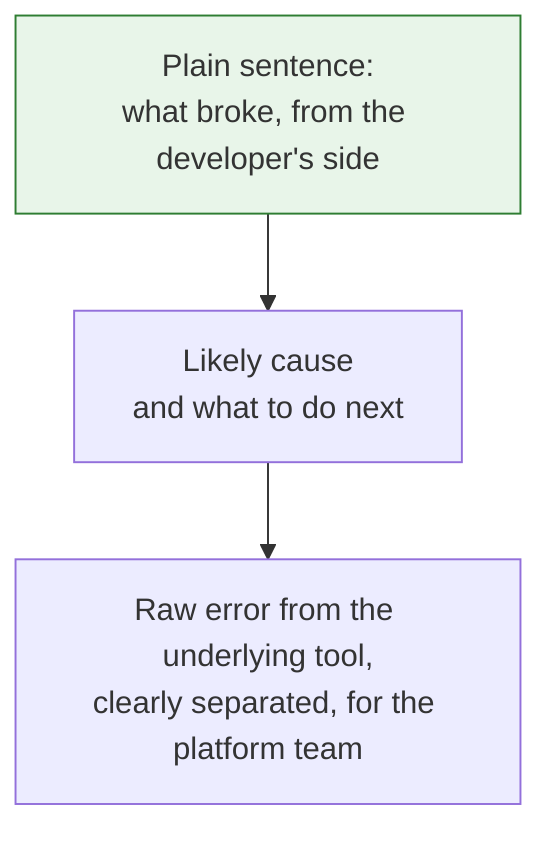

Nobody reads a platform's documentation on a good day. On a good day the pipeline is green, the deploy went out, and the developer never thinks about the platform at all. The platform only gets read when something breaks, and what gets read is the error message.

<!-- more -->

That makes the error message the most-read text a platform team ever writes. It is also, almost always, the text nobody on the platform team wrote on purpose. It is whatever the underlying tool printed, passed through untouched, with a stack trace attached.

I spent a long time treating errors as something that happened to the platform rather than something the platform produced. This post is what changed my mind, and what I do differently now.

## The gap between what it said and what it meant

Here are the kinds of messages developers actually see, next to what the platform team knows they mean. The gap between the two columns is where support requests come from.

| What the developer saw | What it actually meant |
|---|---|
| `ImagePullBackOff` | The image tag you deployed was never pushed. Your build job probably failed. |
| `exit code 137` | The runner ran out of memory. Not your code. |
| `Error: forbidden: User cannot list resource "pods"` | You are in the wrong namespace, or you were never granted access to this one. |
| `KeyError: 'DATABASE_URL'` | The secret for this environment was never created. |
| `x509: certificate signed by unknown authority` | The internal CA is not installed in your base image. |
| `Error: no matches for kind "Ingress" in version "extensions/v1beta1"` | The template you copied is three years old. |

Every row in the right column is something the platform team could have printed instead. None of them did, because the message came from a tool underneath the platform and nobody caught it on the way up.

## 1. An error has three jobs

A useful error message answers three questions, in this order:

1. **What broke?** In one plain sentence, from the developer's point of view.
2. **Why?** The most likely cause, stated as a fact if it is known and as a guess if it is not.
3. **What do I do now?** A command, a link, or a name. Something the developer can act on in the next minute.

If a message does only the first job, the developer knows they are stuck. If it does all three, the developer is usually unstuck before they think of asking anyone.

!!! example "What this looked like for me"

    The first error I rewrote was the image pull failure. The raw version was `ImagePullBackOff` with a pod name. Developers would see it, check that their code compiled, re-run the deploy, see it again, and then ask in the channel.

    The rewritten version, printed by the deploy step, read something like: *"Deploy failed: image tag `abc1234` does not exist in the registry. This usually means the build job for this commit failed or has not finished. Check the build job here: link."*

    The first line was the same information. The second and third lines were the difference between a support request and a self-fix. Questions about that error mostly stopped after the change.

## 2. Write for the person who did not build the system

Most error messages are written, implicitly, for the person who wrote the code that raised them. They use internal names, assume knowledge of the architecture, and skip context that the author never needed because they already had it in their head.

A developer on a product team does not have that context. They do not know that "reconciler" means the deploy controller, that "upstream" means the service behind the proxy, or that error code 4012 is the one about quotas.

The test I use: would a competent engineer who joined last week and has never read our platform code understand this message? If not, it is not finished.

!!! example "The message with an internal name in it"

    We had a validation step that rejected service configs with a message naming the internal component that did the checking. Something like *"rejected by policy-gate: rule R7 failed."* Everyone on the platform team knew what R7 was. Nobody else did, and there was nothing in the message to search for.

    The fix was to make the rule print its own explanation: *"Service config rejected: `memory` must be at most 4Gi for services without a capacity exception. Yours is 8Gi. To request an exception, see: link."* Same rule, same check. The developer just got to read the reason instead of the rule number.

## 3. Put the fix in the message

The most valuable thing an error can contain is the next command to run. Not a description of the fix. The fix.

- A lint failure should print the command that auto-fixes it.
- A missing secret should print the command or link that creates it.
- A permissions error should name the group that grants the permission and where to request it.
- A deprecated config field should print the new field name and the one-line change.

This is also the cheapest place to put documentation, because it is the only documentation that is guaranteed to be read at the moment it is needed.

```text
# Before
Error: validation failed for field 'healthcheck'

# After
Error: 'healthcheck' must be a path starting with '/', got 'healthz'.
Fix:   change it to '/healthz' in service.yaml.
Docs:  https://internal/docs/service-config#healthcheck
```

!!! example "The link that replaced a wiki page"

    For a while the most-linked page in our support channel was a wiki article explaining how to request access to a new environment. Someone would hit a permissions error, ask, and get the link. Dozens of times.

    We put the link in the error message. The wiki page did not change. The number of people who needed to be told about it dropped close to zero, because the tool told them at the exact moment they needed it.

## 4. Lead with the plain sentence, keep the raw detail

The instinct when wrapping an error is to hide the original. That is a mistake. The original error is often the only thing that helps when the plain-language guess is wrong, and someone on the platform team will eventually need it.

The structure that works: plain sentence first, cause and action next, raw detail last and clearly labelled.



The developer reads the top. The platform engineer, if it gets that far, reads the bottom. Nobody has to scroll through a stack trace to find out that a tag was missing.

!!! example "The wrapper that hid too much"

    My first attempt at friendlier errors over-corrected. The deploy tool caught every failure and printed a short summary, and dropped the original output entirely. It was clean until the summary was wrong. Then the developer had a confident sentence pointing at the wrong cause and no way to see what had actually happened.

    We put the raw output back, below a separator, under a heading that said it was for debugging. The summaries stayed. The dead ends went away.

## 5. Treat the most common errors as bugs

Every platform has a small set of errors that account for most of the confusion. You can find them without any tooling: read a month of the support channel and count. The same five or six messages will come up over and over.

Each of those is a bug in the platform, even if the underlying tool is behaving correctly. The bug is that the platform let a confusing message reach a developer. Put them on the backlog, in priority order by how often they appear, and fix them the way you would fix any other bug.

!!! example "The list on the wall"

    At one point I kept a short list of the errors that generated the most repeat questions, ordered by count. It had maybe eight entries. We worked down it during quiet weeks, one rewritten message at a time.

    It was some of the highest-return work the platform team did that year, and almost none of it involved changing what the platform actually did. It only changed what it said.

## 6. Test error messages like features

If a message matters, it deserves a test. Not a test that the error is raised, which most codebases already have, but a test that the message says what it should: names the field, includes the fix, links to the right place.

This sounds excessive until the first time someone refactors the validation code and the helpful message quietly reverts to a generic one. Nobody notices, because errors are not on the happy path, until the support channel fills up again.

## Takeaways

- **The error message is the platform's real interface.** It is read more than any docs page, at the exact moment it matters.
- **Three jobs:** what broke, why, what to do next. A message that does one is not finished.
- **Write for someone who joined last week** and has never seen the platform code.
- **Put the fix in the message.** A command or a link beats a description every time.
- **Plain sentence on top, raw error on the bottom.** Never hide the original.
- **Count the repeat errors and fix them as bugs.** It is cheap, and it compounds.

What I still have not worked out is errors from tools I do not own. When a managed cloud service or a third-party CLI returns something cryptic, the platform can wrap it, but the wrapping is a guess, and the guess goes stale every time the vendor changes their wording.
