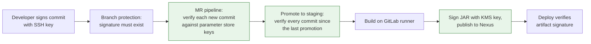

Most teams that "require signed commits" have ticked a box in branch protection and stopped there. That box checks that a signature exists. It does not check that the key belongs to someone you trust, and it does nothing once the code is past the merge button.

<!-- more -->

I worked on an application where that was not good enough. The codebase did cryptographic operations, the security policy was zero trust, and the requirement was blunt: every line of code reaching production has to be traceable to a verified person, and every artifact has to be traceable to a verified build. This post is how I made the pipeline enforce that, and the parts that hurt.

## What "signed" actually proves

A commit signature proves that whoever held a particular private key signed that exact commit content. That is all. It does not prove who holds the key, and it does not prove the key is still trusted today.

| Check | Branch protection alone | Pipeline verification |
|---|---|---|
| A signature is present on each commit | Yes | Yes |
| The signature is cryptographically valid | Yes | Yes |
| The key belongs to a known, identity-verified person | Only if the key is registered with the hosting platform | Yes, against your own key registry |
| Every commit in a promotion, not just the tip, is verified | No | Yes |
| The build artifact is tied to a verified build | No | Yes, if the build signs its output |

The right-hand column is what zero trust actually asks for. The left-hand column is what most teams settle for.

## 1. Pick SSH signing, and own the key registry

We used SSH keys for signing rather than GPG. Every developer already had an SSH key, the tooling is built into git, and there was no separate keyring to teach people.

```bash
git config --global gpg.format ssh
git config --global user.signingkey ~/.ssh/id_ed25519.pub
git config --global commit.gpgsign true
```

The important decision was not the key type. It was where the public keys lived. We did not rely on the keys uploaded to the git hosting platform. We kept our own registry: each developer's verified public key stored in a parameter store, under their identity, managed by the platform team.

That registry is the source of truth. The pipeline reads from it, not from the hosting platform. If a key is not in the parameter store, the commit is not trusted, regardless of what the web UI says.

!!! example "Why the registry had to be ours"

    The git platform will happily show a "Verified" badge next to a commit if the key is attached to any account. That says nothing about whether we had checked who owned the key. For a codebase handling crypto operations, "someone uploaded this key to their profile" was not an acceptable identity check.

    Holding the keys in our own parameter store meant we decided what "trusted" meant, and the pipeline enforced our definition rather than the platform's.

## 2. Verify in the pipeline, not only at the branch

Branch protection stayed on. It is a cheap first gate and it rejects unsigned pushes before they waste anyone's time. But the real check ran inside the GitLab runner.

On every merge request pipeline, the job did the following:

1. List the commits new to that merge request.
2. For each commit, read the author identity.
3. Fetch that person's public key from the parameter store.
4. Build an `allowed_signers` file from the keys, and run `git verify-commit` against it.
5. Fail the job on the first commit that does not verify.

```bash
# Build the allowed-signers file from the registry
for author in $(git log --format='%ae' "$BASE..$HEAD" | sort -u); do
  key=$(fetch_public_key_from_parameter_store "$author") || exit 1
  echo "$author $key" >> allowed_signers
done

git config gpg.ssh.allowedSignersFile allowed_signers

# Verify every new commit, not just the tip
for sha in $(git rev-list "$BASE..$HEAD"); do
  git verify-commit "$sha" || { echo "Unverified commit: $sha"; exit 1; }
done
```

The `BASE..HEAD` range is the whole point. Checking only the tip commit lets an unsigned commit ride in underneath a signed one. Every commit in the range has to verify, or the job fails.

!!! example "Two ranges, two gates"

    On merge request pipelines, the range was "commits new to this MR". That kept the check fast and gave developers a clear signal on their own work.

    On promotion to staging, the range was different: every commit between the previous merge to staging and the current one. That second pass was the one that mattered for the audit trail. It meant nothing could reach staging that had not been verified against the registry, even if it had somehow slipped through an earlier gate.

## 3. Sign what you build, not just what you commit

Verifying commits proves where the source came from. It says nothing about whether the artifact in the repository manager was built from that source by a trusted process.

So the build signed its output too. When the GitLab runner published the JAR to Nexus, it signed the artifact with a KMS key that only the runner's role could use. Deployments verified that signature before installing anything.



With both halves in place, the chain was continuous: a verified person wrote the code, a verified pipeline built it, and the thing running in production could be traced back through both.

## 4. Everything that can break, will

I would like to say the rollout was smooth. It was not. Every failure mode you can think of happened.

- **Rebases and squash merges** rewrote commits and dropped signatures. The rewritten commit was now unsigned and failed the check.
- **Automation commits** from bots and pipelines had no key at all.
- **Key rotation** meant a developer's older commits verified against a key that was no longer their current one.
- **New laptops** meant a developer signing with a key nobody had registered yet.

The fixes were mostly boring, which is the good kind:

- When a rewrite dropped signatures, the developer re-signed and force-pushed their branch. Force push had to be allowed on feature branches for this to work, which took some convincing.
- During key rotation, the registry held both the old and the new key for the same person. Old commits verified against the old key, new ones against the new key, and the old key was removed once nothing depended on it.

!!! example "The force-push argument"

    The instinct on the security side was to forbid force pushes everywhere. But a signature check that rejects rewritten commits, combined with a policy that forbids rewriting them again, leaves a developer with no way out. Their only option is to open a new branch and cherry-pick, which is worse for everyone.

    Allowing force push on feature branches, while keeping it locked on protected branches, was the compromise. The signature check on the protected branch was the real control. The feature branch was a workspace.

## 5. Roll it out with a cutoff date, not a flag day

Turning signature verification on for a repository with years of history would have failed on every old commit at once. Instead we did two things.

First, we verified every developer's key before enforcement. Each person's public key was checked against their identity, the way you would verify a customer before opening an account, and only then was it written to the parameter store.

Second, we set an enforcement date. The pipeline checked signatures only on commits made after that date and ignored everything before it. That gave people a defined window to get their keys registered and their signing configured, and it meant history did not need rewriting.

```bash
CUTOFF=$(date -d "2025-01-01" +%s)
for sha in $(git rev-list "$BASE..$HEAD"); do
  ts=$(git show -s --format=%ct "$sha")
  if [ "$ts" -ge "$CUTOFF" ]; then
    git verify-commit "$sha" || exit 1
  fi
done
```

!!! example "The grace period did most of the work"

    Announcing a date and then enforcing it on that date, with nothing retroactive, meant almost nobody was surprised. The people who had not set up signing found out on their first push after the cutoff, with a clear failure, and fixed it in a few minutes. Without the cutoff, the same rollout would have meant either rewriting history or exempting so much that the check meant nothing.

## What I would still change

The rule I would keep is the one about owning the registry. It is the difference between "signed" and "signed by someone we checked".

The part I have not solved is maintenance. Keys expire, people change laptops, people leave. Every one of those is a manual update to the parameter store today. That is fine at a small scale and a liability at a large one. What this needs is automation: key registration tied to identity provisioning, rotation that updates the registry without a ticket, and revocation that happens the moment someone's access is removed. I have not built that yet.

## Takeaways

- **A "Verified" badge is not identity verification.** Keep your own registry of public keys and decide for yourself what trusted means.
- **Verify in the pipeline, over the full commit range.** Branch protection is a first gate, not the control.
- **Sign the artifact too.** Source provenance without build provenance is half a chain.
- **Expect rewrites, bots, rotation, and new machines to break it.** Allow re-signing on feature branches and hold old and new keys during rotation.
- **Enforce from a date, not from the beginning of time.** Verify keys first, then set a cutoff.

The open question is still key maintenance. Until registration, rotation, and revocation are automated, the trust model is only as current as the last person who remembered to update the parameter store.
