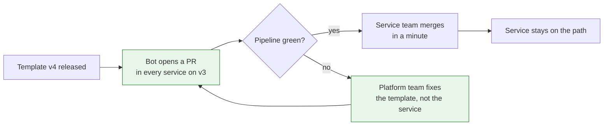

Every platform team I have been on has built a golden path: a template, a paved road, a "blessed" way to build and ship a service. Every one of them was well used for a few months. The interesting question is never whether people start on the path. It is whether they are still on it a year later, and what made them leave.

<!-- more -->

I have watched paths get abandoned quietly, one service at a time, while the adoption slide still said one hundred percent. This post is about why that happens and what I have found actually keeps people on a path without forcing them.

## Why people leave the path

Nobody leaves a golden path because they enjoy maintaining their own pipeline. They leave because, at some specific moment, staying on the path was more work than stepping off it. If you can find those moments, you can fix them.

| The moment | What the developer said | What it actually signals |
|---|---|---|
| Needed something the template did not support | "I just added a step to my copy" | The path was too narrow |
| Template got an update | "I'll upgrade later" | Upgrading was a migration, not a click |
| Something broke inside the template | "I could not see what it was doing" | The path was opaque |
| A new joiner copied an old service | "That is what the last person did" | The path was not the obvious starting point |
| Platform team was slow to respond | "We could not wait" | The path had one gatekeeper |

Each row is a design decision the platform team made, or failed to make. None of them is the developer's fault.

## 1. A golden path is a product, not a policy

The fastest way to get everyone onto a path is to mandate it. The fastest way to get everyone quietly off it is the same mandate. A policy gets compliance on the day it is checked and workarounds on every other day.

A path that people take voluntarily has to be better than the alternative for the person using it, on the day they use it. That is a product question: who is this for, what do they get, and why would they choose it over copying last month's service?

!!! example "What this looked like for me"

    The first path I helped build was rolled out with a mandate: all new services use the template, no exceptions. Adoption was immediate and the dashboard looked great.

    About six months in, I looked at what the services actually contained. Most of them had started from the template and then diverged: an extra step here, a swapped-out base image there, a pipeline job commented out because it was slow. They were on the path in name only. The mandate had been met on day one and ignored from day two, because nothing about the path made staying on it easier than leaving.

## 2. It has to win on day one and on day one hundred

A template is easy to make attractive for a brand new service. Four lines of config and you are deployed. That is day one, and most paths are designed entirely around it.

Day one hundred is different. The service has a queue consumer now, a scheduled job, a second database, a customer-specific quirk. The question on day one hundred is whether the path still fits, and whether the platform team has shipped anything in the meantime that the service can pick up without effort.

Paths that only win on day one lose on day one hundred, and day one hundred is where every service lives most of its life.

!!! example "The template with no upgrade story"

    Our first template was a repository you copied. Copying it was trivial. Updating it was impossible, because once copied, each service owned its own copy and nothing linked it back.

    When we shipped an improvement to the template, exactly one service got it: the next new one. Everything already running stayed on whatever version it had started with. Within a year the template had a dozen versions in the wild and no way to tell which service was on which. The path did not have a day one hundred at all.

## 3. Escape hatches keep people on the path

The instinct is to make the path strict, so that nobody can deviate. In practice a strict path with no exit means the first unsupported need pushes the whole service off it. Now the developer is not deviating in one place. They are maintaining everything themselves.

A better design has a clear, supported way to step off the path for one thing while staying on it for everything else. Add a custom step here. Override this one value. Ship a raw manifest alongside the generated ones. The escape hatch is small, visible, and counted.

Counting matters more than allowing. Every use of the escape hatch is a signal that the path is missing something. If ten services use the same hatch for the same reason, that reason belongs in the path.

!!! example "The hatch that became a roadmap"

    When we added an escape hatch to the deploy template, I expected it to be abused. It mostly was not. What it did instead was give us a list.

    Within a few months the hatch usage clustered around three needs: a sidecar for a particular internal agent, a cron-style job, and a different health check shape. All three became first-class template features, and the services using the hatch for them moved back onto the standard path without being asked. The hatch had not weakened the path. It had told us what to build next.

## 4. Upgrades must be a pull request, not a project

If moving from template version 3 to version 4 requires reading a migration guide, the service will stay on version 3. The only upgrade mechanism that works at scale is one where the platform team does the work and the service team reviews it.

That means the template is not a thing you copy. It is a dependency you reference, with a version. Upgrading is a pull request, opened automatically, with a diff small enough to read and a pipeline run that proves it works. The service team merges it or asks a question. Either way, the effort is minutes.

The second branch is the important one. When the upgrade breaks a service, the fix goes into the template so that it does not break the next one. The service team never has to become experts in the thing they are upgrading.

!!! example "From copied repo to referenced version"

    Moving off the copied-repository model was the single change that made the path survivable. Services referenced a versioned template, and a bot opened a pull request in each one whenever a new version was tagged.

    The first few rounds were rough, because the template had never been upgraded in place before and every hidden assumption surfaced at once. But the fixes went into the template, and after a few releases most upgrade pull requests merged without a comment. The dozen-versions-in-the-wild problem stopped growing, then started shrinking.

## 5. Measure drift, not adoption

Adoption is the easy number and the wrong one. A service that started on the path and has been diverging for a year still counts as adopted.

The number that tells you whether the path is working is drift: how far each service is from the current template. Versions behind, escape hatches in use, files that differ from the generated ones. If drift is low and stable, the path is winning. If drift climbs, people are leaving, whatever the adoption number says.

Drift is also actionable in a way adoption is not. A service three versions behind is a conversation. Twenty services all using the same override is a feature request.

!!! example "The dashboard that replaced the adoption slide"

    We replaced the adoption percentage with a drift view: every service, which template version it was on, and which escape hatches it used. It was a less flattering picture and a far more useful one.

    It changed what the platform team worked on. Instead of building new features and hoping people would take them, we looked at the services with the highest drift and asked why. The answers were usually specific and usually fixable.

## 6. Talk to the people who left

The services that stepped off the path are the best source of information about it, and they are the ones the platform team is least likely to talk to. Leaving feels like a rejection, so both sides avoid the conversation.

It should be the opposite. A service that left had a reason, and the reason is almost always something the path should have handled. Ask, without judgement, and fix the reason. Then make it easy to come back.

!!! example "The one missing feature"

    One team left the path entirely over a single need: their service required a specific network policy the template could not express. Rather than use the escape hatch, which did not cover it, they rebuilt their pipeline from scratch and maintained it themselves for months.

    When we finally asked, the fix took a week. We added the option to the template, they moved back, and two other services that had quietly worked around the same limitation moved back with them. Nobody had raised it because nobody thought the platform team would want to hear it.

## Takeaways

- **Treat the path as a product.** People stay on it because it is better, not because it is required.
- **Design for day one hundred**, not just the first deploy. Most of a service's life is maintenance.
- **Build a small, counted escape hatch.** Its usage is your roadmap.
- **Make upgrades automatic pull requests.** If upgrading is a project, nobody upgrades.
- **Measure drift, not adoption.** Adoption hides the problem. Drift points at it.
- **Ask the people who left why.** Then fix it and make returning easy.

The part I have not figured out is what to do with the services that will never come back: the old ones with no active team, too different to upgrade and too important to ignore. A golden path is for the services that are still moving, and I do not yet have a good answer for the ones that are not.
