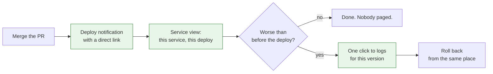

Almost every dashboard I have built or inherited was designed for an operator. Cluster health, node pressure, error rates across the estate, a wall of graphs that makes sense if you are holding the pager and looking for the one thing that is on fire.

<!-- more -->

That is a real audience with real needs. It is just not the audience that uses observability most often. The developer who merged a change twenty minutes ago has a much narrower question, asks it far more frequently, and is usually the person least equipped to answer it with the tools we gave them.

## Two people, two questions

| The operator asks | The developer asks |
|---|---|
| What is broken right now, across everything? | Did the thing I just shipped break anything? |
| Which service is causing this? | Is my service healthy, and was it healthy before? |
| Do I need to page someone? | Can I go to lunch? |
| Is this worse than an hour ago? | Is this worse than before my change? |

The right-hand column is answerable with a fraction of the data in the left. It is also asked ten or twenty times more often. Most platforms optimise entirely for the left column and leave the right to whoever can write a query.

## 1. The first question is always about the deploy

Right after a release, a developer wants to know one thing: is this worse than it was before I pressed merge? Not the absolute error rate. The comparison.

A dashboard showing a line at two percent errors is useless on its own. Was it two percent this morning? Was it zero? The developer usually does not know, and finding out means changing a time range, which means learning the tool, which means most of them do not bother and instead wait to see if anyone complains.

The fix is to make the deploy the unit of observation. Mark releases on the graphs, default the window to span the last one, and put the before-and-after difference in words, not just in pixels.

!!! example "What this looked like for me"

    We had good dashboards and almost nobody outside the platform team opened them. When I asked why, the answer was consistent: people did not know what normal looked like, so a graph told them nothing.

    Adding deploy markers to the service graphs changed that more than any new metric did. Suddenly the question was not "is two percent bad" but "did it change at that vertical line". People could answer that without knowing anything about the system.

## 2. Scope to the service, not the cluster

A developer owns a service. They do not own the cluster, cannot act on node pressure, and should not have to scroll past it.

Every service should have a dashboard that covers only that service and can be reached without choosing anything from a dropdown. Traffic, errors, latency, saturation, restarts, recent deploys. Nothing about the neighbours.

This sounds obvious and is surprisingly rare, usually because the platform team built one excellent dashboard with a service selector at the top. A selector is a small thing for the person who built it and a real barrier for someone opening the tool for the second time this quarter.

!!! example "The dropdown nobody used"

    Our main service dashboard had a variable at the top to pick a service. To us it was elegant: one dashboard, every service. To everyone else it was a page that showed the wrong data by default and had to be configured before it meant anything.

    We generated a per-service dashboard from the same definition instead. Same graphs, same code, no selection step. Usage went up sharply and the questions we got about it changed from "how do I use this" to actual questions about the data.

## 3. Link from where they already are

Nobody navigates to an observability tool. They arrive at it from somewhere else, usually in a hurry, usually from a pull request, a deploy notification, or an alert.

Every one of those places should carry a direct link to the right view of the right service, already scoped and time-ranged. A developer should never have to know the tool's URL, let alone its query language, to answer the question they had.

The links are not a nice touch. They are most of the product. An observability platform that has to be found is an observability platform that does not get used by anyone who is not already fluent in it.

!!! example "The link in the deploy message"

    For a long time our deploy notification said which version had gone out and nothing else. Anyone who wanted to check on it had to open the tool, find their service, and set a time range.

    Adding two links to that message, one to the service view scoped to the deploy and one to that version's logs, was probably an afternoon of work. It did more for how often developers looked at their own telemetry than the previous year of dashboard improvements.

## 4. Logs must be findable without a query language

Query languages are a wall. They are learnable, and the people who learn them get enormous value, and most developers will not learn one to check on a deploy they are already fairly confident about.

The default path to logs should be a link, filtered to the service and the version, sorted newest first, with no syntax involved. The query language stays available for the people who want it and the incidents that need it. It just cannot be the entry point.

The test is simple: can a developer who has never opened the tool get to their service's recent errors in one click from the deploy notification? If not, logs are effectively a platform-team-only feature.

## 5. Tell the owner, not just the pager

Alerts usually route to whoever is on call. That is correct for anything user-facing and urgent. It is wrong for the large category of things that are the owning team's problem and nobody else's: a rising error rate on one endpoint, a queue growing slowly, a job that has started failing overnight.

Those should reach the team that owns the service, in their own channel, during their own hours, without waking anyone. Teams that get told about their own service's problems start fixing them before they become incidents. Teams that never hear anything assume everything is fine, because from where they sit it is.

!!! example "The alerts that went to the wrong people"

    Everything alertable pointed at the on-call rotation, which meant the platform team saw every application-level problem first and had to work out whose it was and who to tell. We were a routing layer made of humans.

    Splitting the alerts into "wakes someone up" and "tells the owning team in their channel" removed a lot of that. The second category was much larger than the first. Most of it had never needed a platform engineer at all; it had just never had anywhere else to go.

## 6. Do not make them learn your cardinality problems

There is a strong temptation to teach developers the internals: why they cannot label a metric with a user ID, what a histogram bucket is, why their query is slow. That knowledge is genuinely useful and it is not their job.

The platform should provide instrumentation that is hard to misuse, sensible defaults, and a clear error when someone does something expensive. Not a training course. Every hour a product developer spends learning the observability stack's failure modes is an hour not spent on the thing they were hired for, and they will forget most of it before they need it again.

## Takeaways

- **Make the deploy the unit of observation.** Mark releases and default to the window around the last one.
- **One dashboard per service, no selector.** Generate them; do not ask people to configure anything.
- **Link from the pull request, the deploy message, and the alert.** Nobody navigates to the tool.
- **Logs in one click, no query language** for the default path.
- **Route non-urgent alerts to the owning team,** not to the pager.
- **Do not teach developers your storage constraints.** Make the safe thing the default.

What I still get wrong is knowing when a developer-facing view has become too simple to be honest. A single green tick after a deploy is exactly what people want and it hides a lot. I have not found the line between reassuring and misleading, and I suspect it moves depending on how much the team already trusts the platform.
