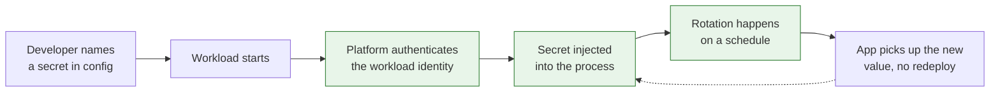

Every secrets policy I have seen written down says the same sensible things. Do not commit credentials. Do not paste them in chat. Do not email them. Every organisation I have worked in has done all three, regularly, including the people who wrote the policy.

<!-- more -->

The instinct is to treat that as a discipline problem and respond with training. I think it is almost always a design problem. People take the shortest path to getting their work done. If the secure path takes twenty minutes and a ticket, and pasting a value into a direct message takes ten seconds, the direct message wins. Not because anyone is careless, but because one route works and the other does not.

The question worth asking is not "how do we stop people doing this" but "what made the wrong way easier".

## Where secrets actually leak

| Where it leaks | What it means |
|---|---|
| Pasted into chat | Getting the value the supported way was slower than asking a colleague |
| Committed in a config file | Local development had no other way to provide it |
| Baked into a container image | The build needed it and nothing injected it at runtime |
| Living in someone's shell history | The tool requires a value on the command line |
| A shared account nobody rotates | Individual access needed approval and the shared one did not |

Every row is a workaround for a path that did not exist or was too slow. None of them is solved by a reminder.

## 1. Measure the secure path in minutes

Before changing anything, time it. From "I need a database password for my new service" to "my code can read it", how long, and how many people are involved?

If that number is measured in days, no amount of policy will hold. Developers will get the value from wherever they can and carry on, and the ones who do it fastest will look like the most effective engineers on the team.

The target is that the supported path is the fastest path available. Not merely acceptable. Fastest. When the secure route is quicker than asking a colleague, the problem mostly solves itself.

!!! example "What this looked like for me"

    I timed our own onboarding path once, pretending to be a developer on a new service. Requesting access, waiting for approval, being told which path to use, and finally getting a working value took the better part of two days, spread across three people.

    In the same organisation, asking a teammate in a direct message took about four minutes. Nobody needed to be told which one to use. The policy said one thing and the arithmetic said another, and the arithmetic always won.

## 2. Secrets should reach the process, not the person

The single biggest reduction in leaks comes from a change in shape: a developer should never hold the value at all.

If the runtime fetches secrets itself, using the identity of the workload, then there is nothing to paste, nothing to store locally, and nothing to rotate in a person's password manager. The developer references a name in config and never sees the value behind it.

```yaml
# service.yaml, what the developer writes
env:
  DATABASE_URL:
    from_secret: orders/db/url
```

They name what they need. The platform resolves it at start-up using the service's own identity. Whether that is a cloud secrets manager, a vault, or something else matters far less than the fact that no human is in the path.

!!! example "The change that removed most of the problem"

    We moved from handing developers values to injecting them at runtime. The developer's config named the secret; the workload's identity was what authorised the read.

    What surprised me was how much it simplified their side. There was no longer any question about where to store the value locally, because there was no value. Most of the awkward conversations we had been having about handling procedures stopped being relevant, not because anyone was more careful, but because there was nothing left to handle.

## 3. Local development is where it breaks

Production is usually fine. Production has identity, injection, and rotation. It is local development that quietly ruins everything, because on a laptop none of that machinery exists and the developer needs something that works right now.

That is where the committed `.env` file comes from. Not from carelessness, but from a real need with no supported answer.

The options that work, roughly in order of preference:

1. **Do not need the secret.** Run against local fakes and a local database with a throwaway password. Most development does not require production credentials.
2. **Short-lived personal credentials.** The developer authenticates as themselves and the tooling fetches a value that expires within hours.
3. **A dedicated development secret,** clearly separated, low privilege, rotated on a schedule.

What does not work is asking people to keep a long-lived production value on a laptop and remember not to commit it.

!!! example "The file everyone had"

    Almost every service repository had an example environment file, and almost every developer had a real one sitting beside it, ignored by git and sometimes not. It was not a rule anyone had broken; it was the only way to run the thing.

    Giving the command-line tool the ability to fetch short-lived values for the developer's own identity is what actually emptied those files. The instruction to stop keeping them had been in place for a long time and had changed nothing.

## 4. Rotation has to be invisible

A rotation policy that requires developers to do something will not be followed past the first quarter. Any secret that a human must remember to change is a secret that does not get changed.

Rotation works when it is a property of the system: the platform issues short-lived credentials, or rotates long-lived ones on a schedule and the application picks up the new value without a redeploy. The developer's involvement should be zero, and the evidence of rotation should be a log line, not a ticket.



The dotted line back is the part most setups skip. If picking up a rotated value requires a restart that someone has to schedule, rotation stops being routine and becomes a small project, which means it stops happening.

## 5. Make the audit trail useful to the developer

Access logging is usually built for auditors and invisible to everyone else. That is a missed opportunity, because the same data answers questions developers genuinely have: which services read this secret, when was it last used, is anything still depending on the old one.

When the audit view is useful day to day, people look at it, and things get noticed. A secret nobody has read in six months is a secret that can be removed. A service reading a credential it should not need is worth a conversation. None of that surfaces if the log exists only for a yearly review.

!!! example "The credential nobody was using"

    When we made access history visible in the same place developers looked at their service configuration, the first useful thing it produced was a list of secrets with no reads at all. Several belonged to services that had been decommissioned; the credentials were still valid and still granting access to things.

    Nobody had been ignoring a cleanup process. There had never been a way to see the information. Putting it where people already looked was the whole fix.

## 6. Detection is the backstop, not the plan

Scanning for committed secrets is necessary and it is not a strategy. By the time a scanner fires, the value is in git history, possibly pushed, possibly public, and the response is a rotation and an awkward afternoon.

Use it, absolutely: a pre-commit hook that catches the value before it is committed is far kinder than a pipeline that catches it afterwards, and both are better than nothing. But treat every hit as a signal about the path, not just an incident to close. Someone needed a value and had nowhere good to put it. Ask what they were trying to do, and fix that.

## Takeaways

- **Time the supported path.** If it is slower than asking a colleague, expect people to ask a colleague.
- **Keep the value away from people.** Inject at runtime against the workload's identity so there is nothing to hold.
- **Solve local development explicitly.** Fakes first, then short-lived personal credentials. Never a long-lived production value on a laptop.
- **Rotate without asking anyone,** including the pickup of the new value.
- **Show access history to developers,** not only to auditors. Unused secrets surface themselves.
- **Treat every scanner hit as a design report,** not only an incident.

The part I have not resolved is third-party credentials. Plenty of vendor integrations still hand you a long-lived key, offer no programmatic rotation, and expect a human to copy it from a web console once a year. Everything above assumes the credential can be issued and rotated by a system, and for that category it simply cannot.
