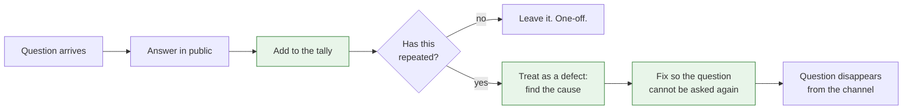

Platform teams are usually bad at user research. We do not run interviews, we do not have a researcher, and the survey we send once a year gets answered by the people who already like us. Meanwhile the same team runs a support channel that receives dozens of real, unprompted, specific accounts of the platform failing its users, every single day.

<!-- more -->

We just do not read it that way. We answer the question, mark it done, and move on. The answer is the least valuable thing in the exchange. The question is the data.

I changed how I worked when I started treating the channel as a research feed instead of a queue. This post is what that looked like.

## The exchange has two halves and we keep the wrong one

A support request has a visible half and an invisible half.

| Visible | Invisible |
|---|---|
| "How do I get logs for my staging pod?" | They looked for the answer and could not find it |
| "Can someone re-run my pipeline?" | They do not have permission, or do not know they do |
| "Is the registry down?" | The error they saw did not say what was wrong |
| "What is the right base image?" | There is no obvious default, or there are three |
| "Who owns the deploy for service X?" | Ownership is not discoverable from the tooling |

The visible half gets answered in two minutes and helps one person. The invisible half, if you collect it, tells you what to build. Every single question is a place where the platform failed to answer for itself.

## 1. Count the questions before you answer them

The cheapest useful thing a platform team can do is keep a tally. Not a ticketing system, not a taxonomy. A tally.

Every time a question comes in, put it in a bucket. Reuse buckets aggressively; if it is roughly the same question, it is the same bucket. After a few weeks the distribution will be extremely uneven, and the top few buckets will account for most of the volume.

That list is your backlog, ordered by how much pain each item causes, measured in the only currency that matters: how often a human had to ask another human.

!!! example "What this looked like for me"

    I started with a text file and a habit. Every question I answered got a line. No categories decided up front, just a short description, and when something repeated I merged it into the existing line and added a tick.

    After about a month there were maybe thirty lines, and the top five accounted for most of the ticks. None of the top five was on our roadmap. All five were small. That file changed what we worked on for the next quarter more than any planning session did.

## 2. The repeat question is the bug

A question asked once is a person having a bad day. The same question asked twenty times is a defect in the platform, and it should be treated exactly like one: reproduced, root-caused, fixed, and verified.

The trap is that answering is so cheap. Two minutes, a link, done. Twenty times two minutes is not the real cost, though. The real cost is the twenty people who were blocked until someone was available, plus the ones who did not ask and worked around it instead.

When a question repeats, the fix is almost never documentation. Documentation is where answers go to be not found. The fix is usually to make the question impossible: a better default, a clearer error, a link in the place they were already looking.

!!! example "The question I answered too many times"

    The single most repeated question I dealt with was some version of "how do I see the logs for my service in staging". I had a good answer. I gave it dozens of times. I linked the documentation page, which existed and was correct.

    What finally stopped it was not a better page. It was putting a direct link to that service's logs into the deploy notification, so the answer arrived before the question. The documentation page did not change at all. The questions stopped almost entirely.

## 3. Watch for the questions that are not questions

Some of the most valuable signals in a support channel are not phrased as requests. They are asides, complaints, and jokes.

- "Ha, the pipeline is red again, business as usual."
- "I just re-run it twice, works eventually."
- "We stopped using that, it was easier to do it ourselves."
- "Do not worry, everyone knows you have to do X first."

None of those is asking for help, so none of them gets logged anywhere. Each one describes a workaround that has become normal. A workaround that has become normal is a feature the platform failed to provide, and nobody will ever file a request for it because they have stopped expecting it to change.

I started keeping these in the same tally as the questions. They were often more useful, because they described problems people had already given up on.

!!! example "The joke that was a roadmap item"

    Someone joked in the channel that the correct way to deploy was to "press the button twice and go get a coffee". It got a few laughs, including mine, and then I realised everyone in the thread knew exactly what it meant. The first deploy attempt failed often enough that re-running had become the accepted procedure.

    Nobody had ever reported it, because it was not broken in a way you could report. It just did not work the first time, reliably enough that people had built a ritual around it. That went into the tally and turned into real work.

## 4. Answer in public, always

A support question answered in a direct message helps one person and produces no data. The same question answered in the channel helps everyone watching, gets found by search later, and stays in your tally.

Push everything into the open channel, politely and consistently. When someone asks privately, answer in the channel and link them. Not to shame anyone, but because the private answer is a small gift to one person and a loss to everyone else, including you.

The loop only closes if step three actually happens. A channel where everything is answered and nothing is counted stays exactly as busy next year as it is today.

!!! example "Moving everything into the open"

    A lot of our support traffic arrived as direct messages, usually to whoever the person had spoken to last. That felt friendly and it was quietly destructive: the same question was being answered in four private conversations, and none of us knew it was common.

    Moving to public-by-default took a few weeks of gently redirecting people. The channel got noisier, which looked like a regression. It was not. The noise had always existed, spread across private messages where it could not be measured.

## 5. Close the loop out loud

When you fix something that came from the channel, say so in the channel, and name the question it came from.

This is not self-promotion. It is the only way people learn that reporting friction leads to it being fixed. Teams that never see that connection stop reporting, and once they stop, the research feed dries up and you are back to guessing.

The message is short: this thing you all kept hitting, here is what changed, here is what you do now. It costs nothing and it is the difference between a channel that gets quieter every quarter and one that gets more useful every quarter.

!!! example "What changed when we said it out loud"

    We had been fixing things from the channel for a while without announcing it, because each fix felt too small to mention. The result was that people kept asking about problems we had already solved, and nobody could tell that the platform was improving.

    Posting a short note each time a channel-sourced fix shipped changed the tone noticeably. People started reporting smaller things, including things they had previously worked around silently. The quality of what we heard went up because reporting had visibly started to pay.

## 6. Be careful what you optimise

Once you start measuring the channel, the tempting metric is response time. It is easy to collect and it looks like service quality.

It is the wrong target. A team optimised for response time gets very good at answering quickly, which makes the channel pleasant and permanent. The goal is not to answer faster. It is to receive fewer questions because fewer things need asking.

The number worth watching is question volume per team per month, or how long the top bucket stays at the top. If the top question is the same one it was six months ago, the platform is not learning, however fast anyone replies.

## Takeaways

- **The question is the data.** The answer helps one person; the pattern tells you what to build.
- **Keep a tally, not a taxonomy.** A text file and a habit will beat a tool nobody updates.
- **A repeat question is a defect.** Fix the cause so it cannot be asked, and do not reach for documentation first.
- **Log the asides and the jokes.** A normalised workaround is a request nobody will ever file.
- **Answer in public** so the data exists at all.
- **Announce channel-sourced fixes** or people stop reporting.
- **Do not optimise response time.** Optimise for the question not being needed.

What I still have not solved is the silent majority. Everything above depends on someone asking, and the teams that struggle most are often the ones least likely to post in a public channel at all. I do not have a reliable way to hear from them short of going and asking, which does not scale.
