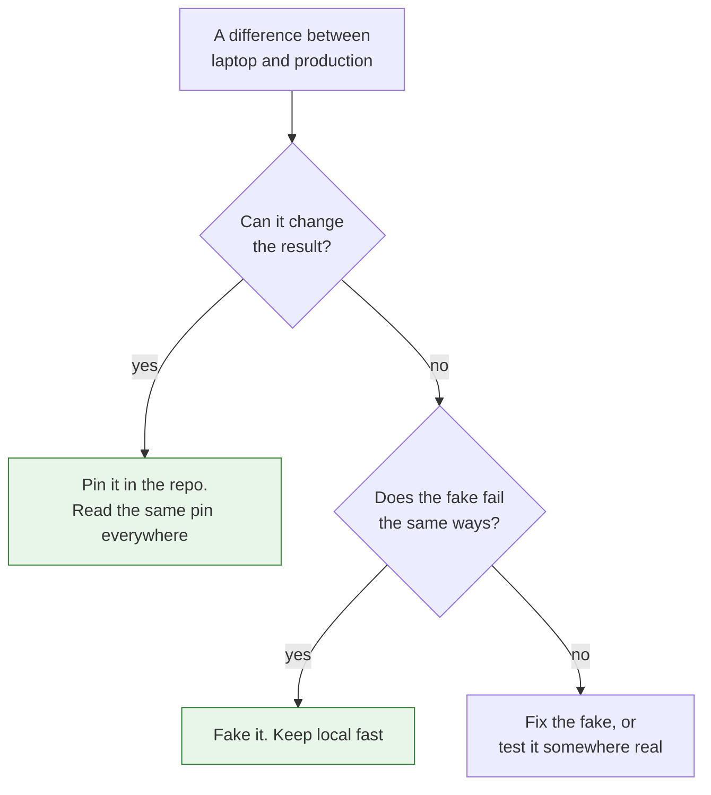

Two failure modes, and I have caused both. The first is a local environment so far from production that "it works on my machine" stops being a joke and becomes a daily fact. The second is chasing full parity until starting the thing locally takes fifteen minutes, eats most of a laptop, and developers quietly stop using it.

<!-- more -->

Neither is a discipline problem. They are both the result of not deciding, explicitly, which differences between a laptop and production are allowed to exist.

I have written before about local and CI needing to run the same commands. This is the neighbouring question and a harder one: how close does a developer's running system need to be to the real one.

## Some differences matter and most do not

| Difference | Does it change behaviour? |
|---|---|
| Database major version | Yes. Syntax, query planning, and migrations all move |
| Runtime version | Yes. This is where most "works locally" bugs live |
| One replica instead of forty | No, until you are debugging concurrency |
| Real payment provider vs a fake | No, if the fake matches the contract |
| No TLS locally | Usually not, until a client library behaves differently |
| Ten rows instead of ten million | Not for correctness. Absolutely for performance work |
| Different operating system | Sometimes. Path handling, file watching, case sensitivity |

The right-hand column is the whole exercise. Parity is not a slider you push toward one hundred percent. It is a set of individual decisions, each of which should have a reason.

## 1. Match the contract, not the infrastructure

The thing a service needs from its dependencies is the contract: the same interface, the same error shapes, the same semantics. It almost never needs the same topology, the same scale, or the same managed service.

A local queue that delivers messages at least once, out of order, and occasionally redelivers is a good stand-in for the production one, whatever runs underneath. A local queue that delivers exactly once and in order is worse than useless, because it lets people write code that cannot work in production and gives them confidence while they do it.

This is the test I use for a fake: does it fail in the same ways as the real thing? If not, it is teaching the wrong lessons.

!!! example "What this looked like for me"

    We had a local stand-in for a message broker that was much friendlier than the real one. It delivered in order, never redelivered, and never dropped anything.

    Code written against it worked locally and then behaved oddly in production, where duplicates and reordering were normal. The stand-in had been chosen because it was easy to run, and the ways in which it was easier were exactly the ways that mattered. Replacing it with something that redelivered and reordered made local development slightly more annoying and caught a category of bug before it shipped.

## 2. Pin the things that change behaviour

Runtime version and database major version are the two that have caused me the most confusion, and both are cheap to fix. Pin them in the repository, read the same pin everywhere, and the whole class of problem disappears.

The rule I use: if a difference can change the result of running the code, it goes in a file in the repository, and both the laptop and the pipeline read that file. If it cannot, it does not need to match.

```yaml
# one place, read by the local tooling and by CI
runtime: "3.12.4"
database: "postgres:16.3"
```

What does not work is documenting the required versions in a README. Nobody re-reads a README after their first week, and versions drift silently from the moment they are written down.

!!! example "The version that drifted"

    The most time-consuming local problem I dealt with was not dramatic: a developer's database was a major version behind what production ran, because they had installed it a year earlier and nothing had ever told them to change it.

    A migration worked on their machine and failed in the pipeline with an error that pointed at the migration rather than the version. Pinning the database image and having the local tooling refuse to start on a mismatch removed that whole category, and the refusal message did more good than any documentation would have.

## 3. Decide what you are deliberately not matching

The parts that are not worth matching should be an explicit, written decision rather than an accident. Scale, multi-region behaviour, real third-party accounts, production data. Each of those costs a great deal to reproduce and buys very little for the work a developer does on a normal day.

Writing them down matters more than it sounds. When a developer hits a bug that only appears at scale, the useful response is "yes, local does not cover that, here is the environment that does" rather than an argument about whether local should have caught it.



The branch on the right is where most local setups go wrong. They fake something, the fake is friendlier than reality, and nobody notices until production disagrees.

## 4. Start-up time is a parity feature

An environment that takes fifteen minutes to start is not a high-parity environment. It is an environment nobody runs, which means its parity is irrelevant.

Every service added to the local stack has a cost paid by every developer, every day, forever. That cost is rarely weighed against the benefit, because the benefit is visible and the cost is spread thin.

The questions worth asking before adding anything to the local stack:

- Does a developer need it running to do their normal work, or only occasionally?
- Can it start lazily, when something actually calls it?
- Can it be a fake that matches the contract rather than the real service?
- What does it add to start-up time, and is that worth it every single day?

!!! example "Cutting the stack down"

    Our local environment had grown to include everything a service might talk to, because each addition had been individually reasonable. Starting it had become something you did while making coffee, and a lot of people had stopped doing it at all.

    Splitting it into a small default set that starts quickly, plus optional extras you opt into when you need them, was not technically interesting and made more difference than anything else on this list. Most developers, most days, needed a fraction of what we had been starting for them.

## 5. Make the difference visible, not surprising

When local and production do differ, the developer should be able to see it rather than discover it through a failure.

A short banner at start-up listing what is real and what is faked costs nothing and prevents a lot of confusion. "Payments: fake. Queue: local, redelivers. Database: postgres 16.3, schema current. Search: not running." A developer who sees that line does not spend an hour wondering why a payment did not arrive.

The same applies to data. If the local database has a small generated dataset, say so, ideally with a note about what it does not contain. Silence gets interpreted as "this is like production", and it never is.

## 6. Test the environment itself

A local environment is a piece of software that the whole team depends on, and it usually has no tests at all. It rots quietly: a fake drifts from the real service's contract, a pin goes stale, a start-up script depends on something that was removed.

A small scheduled job that starts the local environment from scratch on a clean machine and runs the smoke tests against it catches this early. When it breaks, it breaks for one person who can fix it, rather than for whoever next tries to onboard.

!!! example "The setup that only worked if you already had it"

    Our setup instructions worked perfectly for everyone who had run them before, and reliably failed for new joiners. The scripts had come to depend on tools and state that existing machines happened to have.

    Nobody had noticed because nobody started from scratch. Running the whole setup on a clean machine on a schedule surfaced it immediately, and onboarding stopped being a two-day exercise in asking colleagues what else they had installed.

## Takeaways

- **Parity is a set of decisions, not a percentage.** For each difference, ask whether it can change the result.
- **Match the contract, not the infrastructure.** A fake that is friendlier than reality teaches the wrong lessons.
- **Pin what changes behaviour** in the repository, read by both the laptop and the pipeline. Never in a README.
- **Write down what you deliberately do not match,** so the gap is a known limit rather than an argument.
- **Guard start-up time.** An environment nobody runs has no parity at all.
- **Print what is real and what is faked** at start-up.
- **Test the environment on a clean machine** on a schedule, or it rots.

The one I keep going back and forth on is production data. Realistic data catches a whole class of bug that generated data never will, and every approach I have used to get it locally, whether subsetting, masking, or anonymising, has either leaked something it should not have or been so lossy that it stopped being realistic. I do not have a good answer there.
