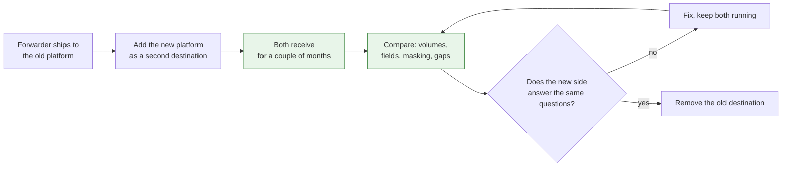

Every platform team eventually has to take something away. The technical part is usually straightforward. What goes wrong is everything between announcing it and switching it off, and the cost almost never lands where you expect.

<!-- more -->

The clearest example I have is moving our logging from Datadog to Dynatrace. The driver was ordinary: cost, plus consolidating logs and metrics onto one platform instead of paying two vendors to hold two halves of the same picture.

I expected the hard part to be the applications. It was not. The applications barely noticed. What actually cost us was the monitoring built on top of the logs, and the fact that a few hundred people had to relearn how to ask a question.

## What I expected to be hard, and what was

| Expected to be hard | Actually hard |
|---|---|
| Changing every application | The forwarder changed; apps mostly did not |
| Getting teams to prioritise the work | It rode along with their normal deployments |
| Log data itself | Custom masking rules tied to the old vendor |
| Nothing in particular | Every monitor and alert built on the old logs |
| Nothing in particular | Teams learning to query in the new tool |

The two bottom rows are the whole story. Neither was on my list at the start.

## 1. Find the thing that is not in the obvious place

On paper the change was small. Logs went to a forwarder, and the forwarder needed to point somewhere new. No application code, no library swap, no redeploy required to change a destination.

What was not on paper was everything that had accumulated inside that forwarder. Over the years it had picked up custom masking rules, written against the old vendor's configuration format, quietly redacting things that must not leave the estate. They were not documented as a dependency on the vendor. They were just part of how logging worked.

That is the shape of the hidden dependency in most deprecations. Not the integration everyone knows about, but the small accretions around it that nobody wrote down because they were never a decision, only a series of fixes.

!!! example "What this looked like for me"

    The forwarder swap itself was an afternoon of work. The masking rules were not, because they had to be reproduced exactly in a different configuration language, and "exactly" is the operative word when the rules exist to keep sensitive values out of a log store.

    Going through them one at a time was tedious and it was also the only responsible option. That was the point where the migration stopped being a config change and became a piece of work with a real review attached.

## 2. Run both, and validate, before removing anything

The decision that made everything else possible was refusing to cut over. For a couple of months, logs flowed to both platforms at once. Nothing was removed while we compared.

Dual shipping costs money, briefly, and it buys the only thing that makes removal safe: evidence. Not a belief that the new pipeline works, but a side-by-side you can point at. Same volumes, same fields, same masking applied, same events present in both.

The loop in the middle is what a validation period is for. Without it, "are we ready to switch off" is a judgement call made under time pressure. With it, the answer is a comparison anybody can check.

!!! example "What the overlap actually caught"

    The overlap did not produce a dramatic discovery, and I count that as the period doing its job rather than being unnecessary. It let us confirm that masking was being applied the same way on both sides, which was the thing I was least willing to guess about.

    Had we cut over directly and been wrong about that, we would have found out from the wrong direction entirely.

## 3. Let it ride on work teams are already doing

We did not run this as a migration project with a deadline and a chase list. Teams picked up the change as part of their normal feature deployments. Whatever they were shipping next carried the new configuration with it.

That choice is worth being honest about, because it trades one problem for another.

What you gain is real. There is no separate piece of work competing with a team's roadmap, no deadline anyone has to defend, and no incentive to rush. The change arrives with something the team wanted to ship anyway.

What you give up is predictability. A team that does not deploy for six weeks has not migrated for six weeks, and the tail is as long as your slowest-moving service. You cannot put a date on the board and be confident about it.

I think it was the right call here, specifically because dual shipping made a long tail harmless. Nothing was breaking while we waited. Take away the overlap and the same approach becomes a slow-motion outage waiting for the least active team.

!!! example "No chase list"

    The thing I noticed most was the absence of the usual conversation. Nobody had to be persuaded, because nobody was being asked to stop what they were doing.

    The trade shows up at the other end. The final stretch is a small number of services that simply had not deployed recently, and those needed individual conversations rather than a broadcast.

## 4. The applications were fine. The monitoring was not

Here is the part I would tell anyone planning a similar move: the migration is not the logs, it is everything built on top of them.

Monitors, alerts and dashboards are written against a specific query language, specific field names, and a specific way the platform structures data. None of that survives a vendor change automatically. Every one of them has to be rebuilt, tested, and trusted again.

That work is invisible in the plan, because nobody thinks of an alert as an integration. It is also the work where getting it wrong is worst: an alert that silently stops firing is far more dangerous than a log line that fails to arrive, and it fails quietly by definition.

!!! example "Rebuilding the things nobody counted"

    The monitors were the bulk of the real effort and were not what I had scoped at the start. Each one had to be re-expressed in the new platform and then actually verified, because the only way to trust an alert is to make it fire.

    If I ran this again, I would treat monitor migration as the main workstream from day one, and the forwarder change as the small task it turned out to be.

## 5. The real cost was people relearning how to ask

The last thing, and the one I keep thinking about, is that the hardest part of this was not technical at all.

People had years of muscle memory in the old tool. They knew how to get from an alert to the relevant log line in three moves, because they had done it hundreds of times. The new platform can answer all the same questions and it answers them differently, and that difference lands during incidents, when nobody has patience for learning.

That is a genuine cost of any tooling migration and it usually goes unnamed, because it does not appear as a ticket or an outage. It appears as things taking longer for a while, and as a quiet preference for the old tool for as long as the old tool still exists.

What would have helped is treating query fluency as part of the migration rather than an afterthought: a short page of the ten queries people actually run, translated, and a channel where asking how to express something was normal rather than an admission.

## 6. Leave a tombstone

When the old destination finally went away, what mattered was that anyone who went looking found an explanation rather than silence. What was removed, when, where the data lives now, and how to ask the question they were trying to ask.

Keep it up longer than feels necessary. The person who needs it is the one who only looks at logs when something is badly wrong, and they will arrive months later.

## Takeaways

- **Look for the accretions,** not the integration. The forwarder was easy; the masking rules written for the old vendor were not.
- **Run both and compare** before removing anything. The overlap buys evidence rather than confidence.
- **Riding on normal deployments avoids the chase list** and gives up predictability. It is only safe if nothing breaks while you wait.
- **Scope the monitors as the main work,** not the pipeline. An alert that stops firing fails silently.
- **Name the relearning cost.** Query fluency is part of the migration, and it is paid during incidents.
- **Leave an explanation behind** for the person who shows up months later.

What I still have no good answer for is the deprecation with no replacement, where the honest message is that a capability is going away and teams will have to do without it. Everything above works because there was somewhere to go. When there is not, the conversation is about priorities rather than migration, and I have never found a way to make that one go smoothly.
