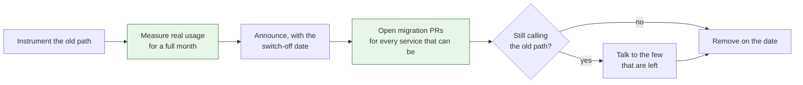

Every platform team eventually has to take something away. An old deploy path, a template nobody should copy any more, a service that has been replaced. The technical part is usually straightforward. The part that goes wrong is everything between the announcement and the switch-off.

<!-- more -->

I have run deprecations that went quietly and ones that turned into a month of firefighting, and the difference was rarely technical. It came down to whether teams believed the deadline, and whether the migration was work they had to do or work that was mostly done for them.

## What you say and what they hear

| What the announcement said | What teams heard |
|---|---|
| "Deprecated, please migrate by March" | Not urgent. There will be a reminder |
| "This will be removed in the next quarter" | Some quarter. Probably not this one |
| "We are extending the deadline to give teams time" | The deadline is negotiable |
| "Final warning before removal" | The previous three warnings were not final |
| The thing actually stops working | Oh. That was real |

The gap between the two columns is trust, and it is spent rather than built. Every deprecation you announce and do not follow through on makes the next one cheaper to ignore.

## 1. The announcement is not the deprecation

A deprecation is a migration project that happens across teams you do not manage. The announcement is the smallest part of it.

If all you do is send a message and set a date, you have transferred the entire cost onto every team that uses the thing, at a moment they did not choose, competing with work they did choose. Most of them will rationally defer it until the deadline is real, which means the last week before removal is where all the work and all the incidents happen.

Planning backwards from the switch-off is the fix. What has to be true a week before? A month before? What can the platform team do so that most services need no work at all?

!!! example "What this looked like for me"

    The first deprecation I ran was an announcement, a date about a quarter out, and a couple of reminders. On the date, a meaningful fraction of services had not moved, and switching off would have broken them, so we extended.

    Extending felt like the responsible choice and it was the most expensive thing we did, because it confirmed that our deadlines were soft. The next deprecation went slower than the first, and I do not think that was a coincidence.

## 2. You do not know who uses it

Almost every deprecation I have been part of started with an assumption about usage that turned out to be wrong. Either a service nobody remembered was depending on the old thing, or half the "users" had already stopped and nobody had noticed.

Before announcing anything, instrument it. Log every use with enough detail to identify the caller, and let it run long enough to catch the weekly and monthly jobs. The list you get is usually shorter than feared and contains at least one genuine surprise.

That list then becomes the entire project plan: it is the set of teams to talk to, and later it is the burn-down that tells you whether removal is safe.

!!! example "The list that was wrong in both directions"

    When I actually measured usage of a deploy path we intended to remove, the results went both ways. Several teams we had been chasing had migrated months earlier and simply never said so. Meanwhile a scheduled job nobody owned was still calling it monthly, which we would not have found in time.

    Measuring first turned a vague negotiation with a long list of teams into a specific conversation with a short one, and surfaced the one caller that would actually have broken.

## 3. Do the migration for them wherever you can

The strongest deprecation is one where most teams have nothing to do. If the change can be made mechanically, make it mechanically: open the pull request in each repository, prove it passes their pipeline, and let the owning team click merge.

This flips the economics. Instead of asking twenty teams to each schedule a small piece of work, you do the work once and ask each team for a review. The remaining conversations are only with the services that genuinely cannot be migrated automatically, and those are the ones that needed a human anyway.

The measurement at the start and the automation in the middle are what make the date at the end keepable. Without them, the date is a hope.

!!! example "Twenty pull requests instead of twenty conversations"

    For one migration the change was almost entirely mechanical: a configuration block moved and a field was renamed. Rather than document it and ask each team to do it, we generated the pull request for every affected repository, with the pipeline already passing.

    Most merged within a few days, some within minutes. The handful that did not were services with something unusual going on, which is exactly where our time was worth spending. The documentation we had written first, and which almost nobody had read, had produced nothing comparable.

## 4. A deadline you do not enforce is a lesson

This is the one I got wrong and would most want to change. When the date arrives and some teams have not moved, extending feels kind. It is kind to those teams and costly to everyone else, because it teaches the whole organisation that platform deadlines are negotiable.

Two things make the date holdable without being reckless. First, do not set a date you are not prepared to keep, which usually means setting it further out than feels necessary. Second, make the consequence of the date proportionate and reversible: the old path stops working, and there is a documented way to turn it back on for a few days if something genuinely breaks.

A switch-off you can reverse in five minutes is much easier to actually perform than one that is permanent, and performing it is the entire point.

## 5. Degrade gradually, and make it visible

A binary switch from working to gone is the most alarming possible version. Turning the pressure up slowly gives teams a real signal that the deadline is approaching, in a form they cannot ignore.

The sequence I have seen work:

1. **A warning in the output**, on every use, naming the replacement and the date.
2. **A warning that also reaches the owning team's channel,** weekly, listing what is still calling the old path.
3. **Deliberate slowness or a brief scheduled outage** close to the date, so the dependency becomes visible to anyone who has not read anything.
4. **Removal.**

Step three feels aggressive and it is far kinder than a surprise on the day. A team that discovers a forgotten dependency during a planned hour-long outage two weeks out has time to react. The same discovery on removal day is an incident.

!!! example "The brief outage that found the stragglers"

    Before one removal we ran a short, announced outage of the old path about a fortnight ahead. Two teams got in touch within the hour, both surprised, both with a dependency they had not known about.

    Without it, both would have found out on the day, at the same time, while we were in the middle of removing the thing. It was the cheapest hour of firefighting I have ever spent.

## 6. Leave a tombstone

When the thing is finally gone, what replaces it matters. A connection refused, a generic 404, or a missing command tells the person nothing and sends them to your support channel.

Leave something behind that explains itself: an error that names what was removed, when, what replaced it, and where the migration guide is. Keep it for far longer than feels necessary, because the caller you did not find in your measurements is exactly the one that runs once a year.

## Takeaways

- **Plan backwards from the switch-off.** The announcement is the smallest part of the work.
- **Measure real usage for a full cycle** before announcing. The list will surprise you in both directions.
- **Automate the migration** and open the pull requests yourself. Twenty reviews beats twenty projects.
- **Do not set a date you will not keep.** Extending is the most expensive kindness available.
- **Degrade gradually,** including a short announced outage before removal.
- **Leave an error that explains itself,** and leave it up for a long time.

What I have not worked out is the deprecation that has no replacement, where the answer is "this capability is going away and you will have to do without it". Every technique above assumes there is somewhere to migrate to. When there is not, the conversation is about priorities rather than migration, and I have never found a way to make that one go smoothly.
