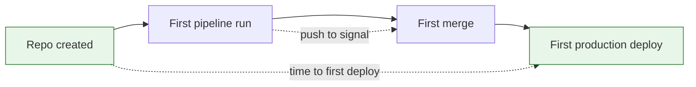

The usual first move when someone decides to take developer experience seriously is to send a survey. It is the obvious thing to do and it is rarely the most useful thing available, because the data you actually need is already sitting in systems you run.

<!-- more -->

I am not against surveys. They capture things instrumentation cannot: whether people feel trusted, whether they think anyone is listening, whether the platform is something they use or something that happens to them. But as a starting point they have three problems, and all three are avoidable.

They are answered by the people who already engage. They measure sentiment at a moment rather than friction over time. And they take weeks to run, which is long enough for the thing that annoyed everyone to be forgotten or fixed.

## The numbers are already there

| What to measure | Where it already lives | What a bad number means |
|---|---|---|
| Time from push to a merge signal | Your CI system | People context-switch while waiting |
| Re-run rate on checks | Your CI system | Nobody trusts red any more |
| Time from repository creation to first production deploy | Repo events and deploy logs | Onboarding a service costs days |
| Support requests per team per month | Your support channel | The platform cannot answer for itself |
| Time from merge to production | Deploy logs | Shipping is a decision, not a default |
| Rollback frequency and time to roll back | Deploy logs | Either quality, or fear of deploying |

None of those requires a new vendor. They require someone to go and count, and then to keep counting.

## 1. Pick numbers that describe a developer's day

The test for a developer experience metric is whether a developer would recognise it as describing their own week. Deployment frequency across the organisation does not. Waiting eleven minutes for a pipeline does.

That rules out most of what gets reported upward. Aggregate throughput numbers are useful to someone, but they average away exactly the thing you are trying to see: that one team waits forty minutes and another waits four, and the average of twenty-two describes nobody.

Keep the numbers per team, or per service, and look at the distribution rather than the mean. The interesting signal is almost always in the tail.

!!! example "What this looked like for me"

    The first number I tracked properly was time from push to a merge signal, per repository rather than overall. The organisation-wide figure had looked acceptable and had told me nothing.

    Broken out per repository, the picture was completely different. A small number of repositories were far slower than the rest, and they belonged to the teams who complained most. The complaint and the data had been saying the same thing for a while; only one of them had been legible.

## 2. Re-run rate is the most honest number you have

If I could keep only one, it would be this: how often does someone re-run a check without changing anything.

Nobody re-runs a check they believe. A high re-run rate means the pipeline has stopped carrying information, and that the team has learned to treat red as noise. It is the clearest possible measurement of trust, and it is free, because your CI system already records it.

It is also a leading indicator. Trust erodes before anything visible breaks. By the time a real failure gets re-run three times and merged, the erosion happened months earlier.

!!! example "What the re-run rate exposed"

    Counting re-runs turned a vague sense that the pipeline was flaky into a short, ordered list of the specific jobs people did not believe. The same few appeared over and over.

    That list was more actionable than any survey response about pipeline confidence would have been, because it named the jobs rather than the feeling.

## 3. Measure the whole path, not your part of it

A platform team naturally measures the parts it owns, which is exactly how the slow parts stay invisible. The queue you control looks fast because it is fast. The wait that hurts is somewhere between two systems, or in another team's inbox.

Measure end to end, from the developer's first action to the outcome they wanted, and treat every handoff as part of the number. If getting a namespace takes two days in someone else's queue, that belongs in time to first deploy whether or not you own the queue.

The dotted spans are the measurements. Both cross boundaries the platform team does not own, and that is the point: they describe the developer's experience rather than the platform's.

!!! example "The wait that was not in our numbers"

    When I walked the new-service path myself and timed it, almost all of the elapsed time was waiting in queues belonging to other teams. Every system I owned was fast, and the developer's experience was still days long.

    Our dashboards had been honest about our part and silent about the total, which made them reassuring and useless.

## 4. Count the questions

Support volume is a developer experience metric and almost nobody treats it as one. Every question is a moment where the platform failed to answer for itself.

You do not need tooling for this. A tally of what gets asked, bucketed roughly and counted, will show you a distribution steep enough to act on within a few weeks. The top few buckets are the platform's real backlog.

Watch the trend rather than the total. A channel that gets quieter each quarter is a platform that is learning. A channel with a stable volume and a fast response time is a platform that has got good at answering the same questions forever.

## 5. Trends, not benchmarks

The question worth asking is whether a number is better than it was last quarter. The question that wastes time is whether it is better than some other company's number.

Published benchmarks come from organisations with different constraints, different regulatory positions, and different definitions of the same word. Comparing against them produces either false comfort or a target nobody can reach for reasons that have nothing to do with effort.

Your own history is the only honest comparison. It shares every confounding factor, which is exactly what makes it useful.

## 6. Do not turn them into targets

The moment a number becomes a target, it stops measuring what it measured. This is not a new observation and platform teams fall into it anyway, usually with the best intentions and a quarterly goal attached.

If re-run rate becomes a target, the tempting fix is to remove the flaky tests rather than fix them. If time to first deploy becomes a target, the fix is to redefine when the clock starts. Both improve the number and neither improves anyone's day.

Keep them as instruments. They tell you where to look and whether something you changed helped. They are not a scoreboard, and the moment anyone's performance review touches them, they are finished as measurements.

!!! example "Where I would put the numbers"

    Putting the measurements where developers could see them, rather than only in a report going upward, changed how they were received. Teams recognised their own figures and occasionally disputed them, which was useful, because a disputed number gets examined.

    The times these numbers were least useful were when they appeared in a summary for people who did not work with the platform daily. At that altitude they stop being diagnostic and start being a score.

## Then run the survey

Everything above measures friction. It cannot tell you whether people feel they can get things changed, whether they trust the platform team, or whether the documentation is any good.

So run a survey, but run it second, when you already know where the friction is. The questions get sharper, the responses are easier to interpret, and you can ask about the specific things your numbers flagged rather than asking people to rate the developer experience out of ten.

## Takeaways

- **Start with what you already record.** Your CI system and deploy logs hold most of it.
- **Per team, not aggregate,** and look at the distribution. The average describes nobody.
- **Re-run rate is the single most honest number** and it costs nothing.
- **Measure end to end,** including the queues you do not own.
- **Count support questions** and watch the trend, not the total.
- **Compare against your own history,** never a published benchmark.
- **Never make them targets.** They are instruments.
- **Run the survey second,** to ask about the things instrumentation cannot see.

What I still do not know how to measure is the work that never gets attempted. Some fraction of good ideas die because someone correctly judges that the platform would make them painful, and none of those decisions leave a trace in any system I run. Everything above measures the friction people pushed through, not the friction that stopped them.
