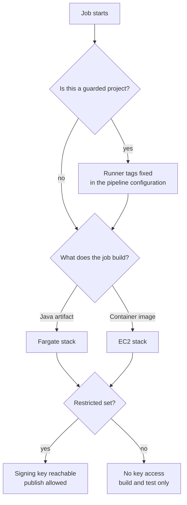

Most discussions about self-hosted CI runners start with cost. Managed minutes are expensive, the argument goes, so run your own and save money. That was not why we did it, and cost is usually the weakest reason on the list.

<!-- more -->

We run our own GitLab runners because of a requirement we could not meet any other way: builds have to sign the artifacts they produce, with a key the build host is allowed to use and nobody else is. Everything below follows from that one constraint, and from the fact that not every build wants the same kind of machine.

## 1. The reason to self-host is usually a requirement, not a saving

If your builds are ordinary, managed runners are the right answer. Somebody else patches them, scales them, and gets paged when they break. You should need a reason to give that up.

Ours was artifact signing. The publish step signs the JAR with a KMS key before it reaches the artifact repository, and the deploy step refuses anything that does not verify. That only works if the machine doing the signing is one we control: our account, our IAM role, our network path to the key, and no shared tenancy with builds that should never reach it.

Once you own the compute for that reason, the other arguments start to matter — private network access, predictable machine sizes, caches that survive between jobs. But they are consequences, not the case.

!!! example "What actually forced the decision"

    We had already moved to signed commits, verified in the pipeline. The next question from the security side was the obvious one: you have proved who wrote the code, so can you prove which build produced the binary?

    Answering that meant the runner had to hold an identity: not a secret pasted into a CI variable, but a role with permission to use one specific key, scoped so only jobs from projects meant to sign could assume it. You cannot do that on shared managed compute in any way I was comfortable defending.

## 2. Split the compute by what the job builds, not by who owns the job

We run everything from one centralised AWS account, with two kinds of executor behind it: ECS Fargate and EC2. The split is not by team or by environment. It is by what the job actually does.

| Job type | Runs on | Why |
|---|---|---|
| Java builds, tests, artifact publish | ECS Fargate | Ordinary processes, no privileged access needed, scales to zero |
| Container image builds | EC2 | Needs a real Docker daemon and a disk that behaves like a disk |

Fargate is the better default. No host to patch, capacity appears when a job appears, and nothing is running means nothing is billed. For a Maven or Gradle build that is all upside.

Container builds are where it stops working. Building an image wants a daemon, layer storage that behaves like a local disk, and occasionally privileges a serverless container platform is specifically designed not to give you. You can fight that with alternative builders, and we looked at it, but EC2 hosts do this without argument and Fargate does it with a fight.

So Java builds go to Fargate, Docker builds go to EC2, and the developer writes neither of those words. They pick a runner tag and the tag decides.

!!! example "The rule that removed the question"

    Before we split it, the recurring question in the platform channel was *"which runner should my job use?"*, and the answers people gave each other were folklore copied from whichever project they had worked on last.

    One sentence fixed most of it: **if the job builds an image it runs on the EC2 tag, and everything else runs on the Fargate tag.** That fits in a template comment, and nobody has to understand executor internals to get it right. The jobs that still get it wrong are the ones that do both, which is usually a sign the job is doing too much anyway.

## 3. Isolation is a decision you make once, early, and live with

Each executor type runs as two stacks, and each stack has two sets of runners separated by a restricted flag. Restricted runners can reach the signing key and the production-facing artifact paths. Unrestricted ones cannot, and that is enforced by the role attached to the runner, not by anything in the project's pipeline file.

The reason for two sets rather than one is simple: if every runner can assume the signing role, every project in the instance can sign, including the one someone created this morning to try something out. Permission on a runner is permission for whoever can schedule a job onto it.

The thing I would tell anyone starting this: decide the isolation boundary before you have twenty projects on the runners, not after. Adding a project to the restricted set is a five-minute change. Taking access away from projects that have quietly come to depend on it is a quarter of conversations.

!!! example "Why the flag sits on the runner and not in the pipeline"

    The first version had the signing step guarded by a check inside the pipeline template: if the project was on the approved list, the step ran. That is a check a project can edit its way around, because the pipeline file lives in the project's own repository. The list was in the right place for convenience and the wrong place for security.

    Moving the boundary onto the runner's IAM role changed the failure mode. A project that is not supposed to sign does not fail a policy check. It gets an access-denied from AWS, because the machine it runs on genuinely cannot use the key.

## 4. For critical projects, the pipeline configuration is not the team's to change

Alongside the tagging, we run what we call guarded CI. For a short list of critical projects, the pipeline configuration is hardcoded: the runner tags, the signing step, and the verification step are fixed, and the project cannot override them from its own file.

This is a deliberate reduction in flexibility and it is unpopular in exactly the way you would expect. The argument for it is that the controls on a critical application should not be removable by editing a YAML file in that application's own repository. If a team can turn off the check that protects them, the check is a suggestion.

The cost is real: guarded projects wait on us for changes other teams make themselves. We keep the list short so that stays survivable.

!!! example "Where guarding earns its keep"

    The moment that justified it was mundane. A build was failing on the verification step, and the quickest path to green — the one anybody under pressure reaches for — was to comment the step out and come back to it later.

    On a normal project that works, and sometimes nobody notices for a month. On a guarded project it does nothing, because the step does not come from the project's file. The team pinged us instead, and the cause was a stale key reference that took minutes to fix. Being unable to bypass the check is what got the right people looking at it the same day.

## 5. Caching is where self-hosted runners give the time back

*The specifics here are the pattern I would recommend rather than a story I am retelling exactly.* A Java build that resolves dependencies from scratch every time spends a meaningful chunk of every run redoing work. Self-hosted runners let you fix that, and it is the clearest developer-visible win available.

Two things matter more than the rest:

- **A shared dependency cache in S3**, keyed on the lockfile, so a build only pays full resolution cost when dependencies actually change.
- **Warm layer storage on the EC2 hosts** for image builds, so a rebuild of an application whose base image has not changed reuses the layers it already has.

The trap is treating the cache as free. A cache that is never invalidated eventually serves something stale and costs you an afternoon, and a cache keyed too loosely is a correctness problem wearing a performance costume. Key it on the lockfile, expire it on a schedule, and make cache hits and misses obvious in the job log.

!!! example "The shape of the win"

    The pattern to expect is that the first build after a dependency change pays full price and every build after it takes noticeably less. What makes it worth doing is the common case rather than the average: a small code change on a project whose dependencies have not moved in weeks gets fast, and that is where developers spend almost all their time.

## 6. The maintenance is the part nobody puts in the estimate

*Also a recommendation rather than a specific recollection.* Building the runner setup gets estimated. The ongoing cost usually does not, and it is not small:

- Patching the EC2 hosts, and rotating them often enough that patching is routine rather than an event.
- Keeping the runner version in step with the GitLab instance, because drift produces failures that look like project problems.
- Watching the autoscaling behaviour, because a capacity problem arrives at the worst moment and looks like a slow pipeline.
- Telling platform failures apart from project failures quickly enough that the distinction is useful.

Budget it as a standing share of somebody's time, not as a project with an end date. If nobody owns it, the runners keep working right up until the day they very loudly do not.

## 7. What developers actually notice

Not the architecture, and not the isolation model. They notice that a build sometimes takes longer to start than it should, and that the reason is invisible from where they sit.

That is a queueing effect and we have not solved it. Concurrency limits are an awkward trade: set them high and a busy afternoon has several heavy builds fighting over the same hosts, so everything slows at once. Set them low and jobs queue while capacity sits idle, because the limit rather than the machine is the constraint. We are still tuning it.

The mitigation that helped most was not a capacity change. It was making the wait visible: if a job is queued rather than running, a developer should see that without asking, because *queued* and *slow* are different problems and only one of them is theirs.

## Takeaways

- **Self-host for a requirement you cannot meet otherwise**, not for a saving. Ours was signing artifacts with a key only our build hosts can use.
- **Split executors by what the job builds.** Fargate for ordinary builds that scale to zero, EC2 for image builds that want a real daemon and a real disk.
- **Put the isolation boundary on the runner's role**, not in a pipeline file the project can edit.
- **Guard the configuration for critical projects**, keep that list short, and accept that it costs those teams some autonomy.
- **Cache deliberately**, key on the lockfile, and make hits and misses visible in the log.
- **Budget maintenance as standing time.** Patching, version drift and scaling behaviour do not stop arriving.

What I have not worked out is the concurrency question. Every setting we have tried is a choice about who waits and when, and the right answer probably changes with the time of day in a way a single number cannot express.
