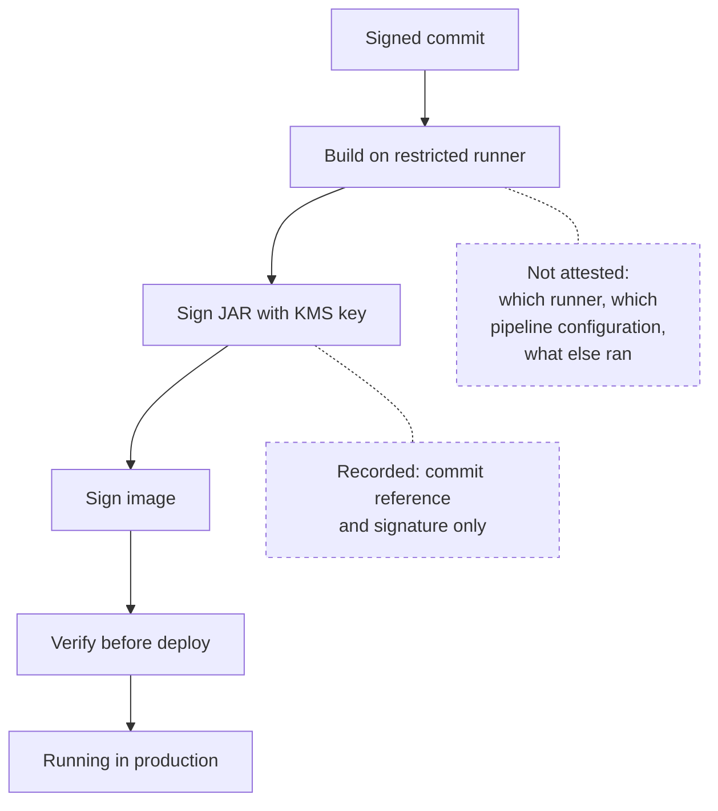

I wrote earlier about verifying commit signatures in the pipeline, and mentioned in passing that the build signs its own output. That sentence deserves a post of its own, because signing an artifact is easy and the claims people make about it are usually larger than what it actually supports.

<!-- more -->

What we have works. It is also narrower than the phrase "supply chain security" suggests, and the honest version is more useful to anyone building the same thing than a diagram with green ticks on it.

## 1. Sign the JAR and the image, because only one of them gets deployed

We sign both the JAR and the container image. For a while it was only the JAR, and that was the wrong place to stop.

The JAR is what the build produces. The image is what actually runs. Sign only the JAR and you have proof about an input to a later step and nothing about the thing that reaches the cluster, so anyone who can influence how the image is assembled sits in a gap the signature does not cover.

| What you sign | What that lets you check | What is still open |
|---|---|---|
| The JAR only | The library came from a trusted build | Nothing about the image that wraps it |
| The image only | What runs was built by a trusted pipeline | Nothing about the code inside it |
| Both | Each handoff is checkable on its own | Whether the build itself did what it claimed |

!!! example "Why the second signature got added"

    The first version signed the JAR at publish time and stopped there. On paper the chain looked finished: signed commits, signed artifact, verification before deploy.

    The question that broke it came from outside the platform team: *the thing running in production is an image, so what have you proved about the image?* The answer was nothing. The image was built in a separate job, from a base image we pulled and a JAR we trusted, and no signature covered the result. Signing the image closed that step — not the whole chain, as the rest of this post gets into, but it moved the boundary somewhere defensible.

## 2. Only the build can sign, and that is the whole control

Access to the signing key is restricted to the runner's role. No developer has it, no local build can produce a signed artifact, and there is no break-glass path that puts the key on a laptop.

That restriction is the entire security property. Everything else — the verification step, the metadata, the pipeline configuration — is plumbing that only means something because the key is unreachable from anywhere except the build. The moment a person can sign, a signature stops saying "this came from the pipeline" and starts saying "this came from the pipeline, or from someone who was in a hurry".

So the interesting question is not *how do we sign* but *who can schedule a job on a runner that holds the signing role*. That is a CI access question wearing cryptographic clothes, and it is where the real risk lives.

!!! example "The request I keep having to turn down"

    The recurring ask is for a way to sign locally, and it is always reasonable in the moment: a release is blocked, the pipeline is red for an unrelated reason, the artifact is fine — can someone just sign it and push it through?

    Saying no to that is the job. If a human can sign, every signature in the system becomes "probably from the build", and a signature that means *probably* is not worth the pipeline minutes it costs. What we do instead is keep the pipeline path fast enough that the question is about waiting rather than being blocked — and when that stops being true, the pressure to build a bypass comes straight back.

## 3. Verify at the point of use, and fail the deploy

*The specifics in this section are the pattern rather than a story I am retelling exactly.* Verification happens in the deploy job, before the artifact is pulled down and installed. If the signature does not verify, the deploy fails. There is no warning mode and no override flag.

Two details matter more than where the check sits. **Fail closed:** a step that logs a warning and continues is documentation, not a control. And **say why in the first line:** "no signature found" and "signed with an unknown key" are different problems with different fixes, and nobody should need a security runbook to tell them apart.

!!! example "The failure message worth writing properly"

    The most common verification failure is not an attack. It is an artifact that predates the control, or one promoted between environments by a path that did not carry the signature with it. With a generic message both produce the same outcome: a red deploy, a developer who did nothing wrong, and a support request.

    Both are obvious if the message names the artifact, says whether a signature was absent or unrecognised, and links to the one page explaining what to do next. The check is the easy part; the message decides whether people trust it.

## 4. A signature is not provenance

Here is the part I would want to read if someone else had written this post.

What we record alongside the artifact is the commit and the signature. That is it. There is no signed attestation describing the build, no record of which runner produced it, no statement of what the pipeline configuration was at the time.

So the chain supports this claim: *this artifact was signed by our build, and it says it came from this commit.* It does not support the claim people tend to hear, which is: *this artifact was built from this commit, by this pipeline, with nothing else added.* The commit reference is metadata the build wrote about itself. A signature over self-reported metadata proves the signer, not the statement.

That is not a reason to skip signing. It raises the cost of tampering after the build, which is the most likely place for it to happen. It is a reason to be careful about the sentence you put in a compliance document. "Traceable" is true. "Provable" is not, yet.

!!! example "The distinction that matters in an audit conversation"

    The useful move in review is to say plainly which claim the setup supports, rather than showing the diagram and letting people read the stronger one into it.

    Traceability is genuinely valuable: given an artifact we can get to a commit, and given a commit to a verified author, and every link is checkable. What we cannot do is prove the build did only what the pipeline file said. Closing that means attesting the build itself, which is a larger piece of work than signing ever was.

## 5. Key rotation is the failure you will actually hit

Not an attacker. A lost key.

When a developer loses their key — a replaced laptop, usually — they generate a new one, and everything signed with the old key is suddenly signed by something the verifier does not recognise. The signature is still valid; the key it points to is no longer registered.

The fix is to keep old public keys rather than replace them. The parameter store holds retired keys alongside the current one, so historic signatures keep verifying while new work is signed with the new key, and revocation becomes a deliberate act for a key you believe is compromised rather than a side effect of someone getting a new machine.

This is the single most useful thing I would tell anyone rolling out signing of any kind. **Design for rotation before you design for enforcement.** Enforcement is a day of work. Rotation is what determines whether the control survives contact with normal life.

!!! example "What it looks like when you have not planned for it"

    The pattern is always the same. Someone gets a new laptop, generates a fresh key, and their next few pieces of work fail verification. From their side the control is broken: they did nothing unusual and the pipeline is refusing their change. Keeping retired keys in the store fixes it, and it costs nothing except deciding once that key history is state you keep rather than state you overwrite.

    What still needs a human is deciding whether a key was *lost* or *taken*. Those need opposite responses — keep the old key so history verifies, or revoke it so it stops — and no automation tells you which one you are looking at.

## 6. The part that is still unsolved: knowing which commits are new

The gap I have not closed is not about signing at all. It is about deciding which commits a pipeline run is supposed to check.

When a branch is pushed for the first time, the "before" reference the hook receives is all zeros — there is no previous state to compare against. You cannot tell from that alone where the new work starts. If the branch was taken from another branch rather than from the mainline, walking back from the tip picks up commits that belong to whoever wrote them, not to the person pushing now.

The consequences run both ways, and both are bad:

- **Too wide:** the check covers commits from before the branch point, and a developer is blocked by history they did not write.
- **Too narrow:** the range misses commits, and unverified work reaches a protected branch while the pipeline reports green.

Comparing against the mainline merge base is the obvious answer and it is not reliable either — a branch taken from a branch has a merge base that is not where the developer thinks it is, and a rebase moves it after the fact.

!!! example "How we live with it today"

    We compare against the mainline and accept that a branch taken from another branch is a case we get wrong. When it happens the developer sees a failure they cannot explain, asks in the channel, and we look at the range by hand. Calling that a solution would be generous — it is a known rough edge with a manual escape, which is the honest description of most controls at this stage.

    What I think the real fix looks like is recording the verified range rather than recomputing it: storing what has already been checked, so the pipeline asks *what is new since the last verification* instead of inferring the boundary from the push. I have not built it.

## Takeaways

- **Sign every artifact that gets handed on**, not only the first one. The JAR and the image are both handoffs.
- **Keep the signing key reachable only from the build.** That restriction is the security property; everything else is plumbing.
- **Fail the deploy on a bad signature**, and make the message distinguish "no signature" from "unknown key".
- **Be precise about what you have.** A signature over self-reported metadata gives you traceability, not attested provenance.
- **Plan key rotation first.** Keep retired public keys so history still verifies, and treat revocation as a deliberate decision.
- **Work out how you will identify new commits** before you enforce anything on them. It is harder than the signing.

The signature part of this was a week of work. The part I am still circling is knowing exactly which commits a given run is responsible for, and until that is solved the enforcement around it is only as trustworthy as the range it was handed.
