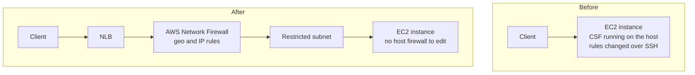

For a long time the firewall in front of one of our applications was CSF, running on the EC2 instance itself. It worked. Changing a rule meant connecting to the box and running a command, and that sentence is the entire reason we moved away from it.

<!-- more -->

The replacement is AWS Network Firewall, sitting outside the application server, with the instances moved into a restricted subnet behind it and a new network load balancer in front. The security argument for that is easy. The part worth writing about is what it changes for the people who used to be able to fix things themselves.

## 1. A firewall on the box is only as strong as access to the box

CSF's problem was not its rules. It was where it lived.

A host firewall is configured by someone with a shell on the host. That means the set of people who can change the firewall is the set of people who can log in, and those two sets should not be the same. It also means the configuration lives in a place nothing else reads: not in a repository, not in a template, not in anything you can diff. The current state of the rules is whatever the last person to run a command left behind.

| | Firewall on the instance | Firewall outside it |
|---|---|---|
| Who can change a rule | Anyone with shell access | Anyone who can change the firewall resource |
| Where the rules live | On the box | In infrastructure configuration |
| How you audit them | Log in and look | Read the resource |
| If the host is compromised | The attacker can edit the firewall | The firewall is unaffected |

The last row is the one that ends the argument. A control that an attacker on the host can turn off is not protecting you from an attacker on the host.

!!! example "The question I could not answer well"

    What finally moved this was being asked to produce the current rule set for review. The honest answer was that I could tell them what the rules were *right now*, by going and looking, but not who had last changed them or why.

    There was no history. CSF's configuration was state on an instance, and instances get replaced. Every rebuild carried the rules forward through whatever mechanism had put them there in the first place, and that mechanism was never quite the same twice.

## 2. The new shape: restricted subnet, firewall outside, load balancer in front

The topology changed more than the tooling did. Network Firewall was already in the account, used alongside EC2. The move was to put the application instances into a restricted subnet behind the firewall, and to front the whole thing with a new NLB.

Three things follow from that picture:

- **The instance stops being the boundary.** It sits in a subnet that cannot be reached except through the firewall, so the host no longer needs to defend itself.
- **The rules become a resource.** They are described, versioned and reviewed like any other piece of infrastructure, rather than typed into a terminal.
- **There is a new component in the path.** The NLB is one more thing that can be misconfigured, and one more place to look when traffic does not arrive.

That last point is a real cost. We replaced a simple path with a longer one, and a longer path has more places to be wrong.

!!! example "What the new piece bought us"

    The NLB was not there to balance load. With the instances inside a restricted subnet, something has to terminate the connection on the outside and hand it on, and that something needs to be a resource we can point the firewall at.

    It also gave us a single place where traffic enters, which is what made the geo rules meaningful. Before, an instance with a public address had its own front door. Several instances meant several front doors and several copies of the same rules, kept in step by hand.

## 3. "Allow this country" is not what a geo rule should say

The thing people assume about geo-IP filtering is that you pick countries and allow them. That is a very blunt instrument and it would not have passed review here.

Our rules are scoped to a specific region on a specific port. Not "traffic from this country", but "traffic from this region, to this port". Everything else is denied, and specific addresses get their own allow entries where a known source needs to reach something the geo rule does not cover.

The reason to be narrow is that geography is a weak signal. An allow rule on a country is enormous: it admits every compromised machine in that country, and it still fails to admit a legitimate user who happens to be travelling. Pinning it to a port at least means the rule only opens what the application actually serves, so a broad source range cannot be used to go looking for something else.

!!! example "Where the specific-IP entries come from"

    The geo rule covers ordinary traffic. The individual address entries are for the known, named sources — the systems that have to reach the application and do not fit the pattern.

    Those entries are the part that needs discipline. Each one is a small exception, and a list of small exceptions is how an allow-list quietly becomes an allow-all. The rule I would hold to is that every address entry needs to name what it is for, and anything that cannot be named should not be there.

## 4. Run both at once, and resist the urge to cut over

We did not switch. For the migration, CSF and Network Firewall both ran, both enforcing, with the host firewall still in place while traffic moved to the new path.

Running two firewalls in parallel is awkward on purpose. It means either one can block traffic, and it means that when something is refused you have two places to check. That is the cost, and it buys the one thing that matters: you are never in a state where the old control is gone and the new one has not been proved.

The sequence that worked:

1. Build the new path — subnet, firewall, load balancer — with rules intended to match what CSF already allowed.
2. Move traffic to the new path with CSF still enforcing on the host.
3. Watch for anything the new rules deny that the old ones allowed.
4. Only once that has been quiet for a while, take the host firewall out.

Step 3 is where the real work is. Everything else is configuration.

!!! example "Why the overlap is worth the confusion"

    The temptation is always to do it in one change, because two firewalls is a confusing state to be in and nobody enjoys explaining it.

    But a cutover means the first time your new rules face real traffic is also the moment you have nothing to fall back to. Any gap between what CSF allowed and what you think it allowed shows up as an outage rather than as a denied-traffic log entry you can go and read.

    Keeping both on turns that class of mistake from an incident into a finding.

## 5. Who can change a rule now, and how long it takes

*This section is the pattern I would argue for rather than a process I am reporting.* This is the part that costs the application team something, and it is worth being honest about rather than presenting the move as pure gain.

Before: someone with access to the instance ran a command. Minutes, no ticket, no review — and no record either.

After: the rule is a change to infrastructure owned by whoever owns the firewall. That is slower by construction, and if the application team does not own that infrastructure, they now wait on someone else for something they used to do themselves.

The trap is treating the delay as acceptable because the control is better. Developers do not experience a security improvement; they experience the thing that used to take five minutes now taking a day. If a routine rule change needs a conversation, people start designing around the firewall instead of asking it for what they need, and you end up with traffic routed somewhere easier rather than somewhere correct.

What I would aim for: the application team can propose a rule change as a reviewable change, it goes through the same pipeline as any other infrastructure, and the review is about whether the rule is right rather than about whether the request is allowed to exist.

## 6. What to expect to break

*Also a prediction rather than a report.* Two failure modes are worth watching for, and neither of them looks like a firewall problem when it happens.

- **Traffic that worked by accident.** Something was reaching the application on a path nobody documented, because the host firewall allowed it or because the instance had a public address. The new path denies it, and the first symptom is a system that stopped working for reasons unrelated to any change in itself.
- **A source that does not fit the geo rule.** A legitimate caller outside the allowed region, or on a port the rule does not cover, which previously got in through a host rule that someone added once and never wrote down.

Both are the same underlying problem: the old rule set was never fully known, so "match what CSF allowed" is an approximation. The parallel run is what turns those into log entries you read rather than outages you explain, which is the whole argument for section 4.

## Takeaways

- **A firewall on the host can be edited by anyone who reaches the host**, including an attacker. That is the reason to move it, not tidiness.
- **Move the instances behind the boundary**, so the host does not have to defend itself. Accept that the path gets longer and has more places to be wrong.
- **Scope geo rules to a region and a port**, not a country. Keep specific-IP exceptions named and few.
- **Run both firewalls during the migration.** It is confusing and it turns a class of outage into a log entry.
- **Watch the cost to the application team.** A rule change that used to take minutes and now takes a day is a developer experience problem, whatever it did for the security posture.

What I am still unsure about is whether we have found the right place for the rules to be reviewed. Putting them in infrastructure configuration fixed the audit problem completely, and it moved the delay onto the people who need a rule changed. Those are not the same trade, and I do not think we have finished making it.
